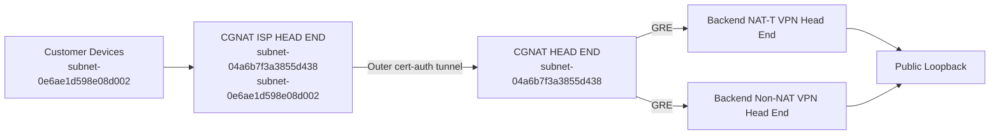

# Lab Topology

## Purpose

This document defines the minimum topology required to test and demonstrate the
CGNAT design.

The goal is not to build the full production footprint on day one. The goal is
to create the smallest environment that can prove:

- outer certificate-authenticated tunnel establishment
- inner customer S2S VPN traversal through that tunnel
- preservation of the existing customer-facing public IP target
- steering from the CGNAT HEAD END to backend VPN head ends
- public loopback termination behavior
- optional NAT from customer-original inside space to platform-assigned inside
  space

## Required Logical Topology

## Minimum Test Components

### 1. CGNAT HEAD END

One platform-side CGNAT HEAD END is required.

Placement:

- only in `subnet-04a6b7f3a3855d438`

Primary purpose:

- terminate the outer certificate-authenticated tunnel
- steer inner VPN traffic across GRE to backend VPN head ends

### 2. CGNAT ISP HEAD END

One ISP-side CGNAT ISP HEAD END is required.

Placement:

- `subnet-04a6b7f3a3855d438`
- `subnet-0e6ae1d598e08d002`

Primary purpose:

- establish the outer certificate-authenticated tunnel
- serve as the upstream path for downstream Customer Devices

### 3. Customer Devices

At least one Customer Device is required for the first lab pass.

Placement:

- only in `subnet-0e6ae1d598e08d002`

Primary purpose:

- initiate the inner S2S VPN through the CGNAT ISP HEAD END
- point that inner S2S VPN at the same public IP currently used by the
  muxer-backed service path
- generate service traffic after the inner VPN is up

### 4. Backend VPN Head Ends

At least one backend VPN head end is required to prove the inner-VPN model.

Preferably, the lab should be able to reach both:

- a NAT-T backend VPN head end
- a non-NAT backend VPN head end

Primary purpose:

- receive inner VPN traffic via GRE
- present the public loopback identity
- terminate the inner VPN
- perform optional NAT if required by the test case

## Placement Rules

The lab topology must enforce the approved subnet constraints:

- CGNAT HEAD END only in `subnet-04a6b7f3a3855d438`
- CGNAT ISP HEAD END only in:
  - `subnet-04a6b7f3a3855d438`
  - `subnet-0e6ae1d598e08d002`
- Customer Devices only in `subnet-0e6ae1d598e08d002`

These constraints must be represented by variables/config rather than hardcoded
assumptions.

## Variable-Driven Topology Inputs

The lab design should treat these as variable-driven inputs:

- instance role names
- subnet assignments
- interface/subnet bindings
- public-facing addresses
- loopback addresses
- customer-original inside space
- platform-assigned inside space
- backend GRE targets

## Minimum Test Scenarios

The first lab topology should be capable of exercising these scenarios:

### Scenario A: Outer Tunnel Bring-Up

- CGNAT ISP HEAD END authenticates with certificates
- CGNAT HEAD END accepts the tunnel without relying on fixed peer public IP

### Scenario B: Inner VPN Traversal

- Customer Device initiates the inner S2S VPN through the established outer
  tunnel
- Customer Device continues to target the existing customer-facing public IP
- CGNAT HEAD END observes and steers the inner VPN to the intended backend VPN
  head end

### Scenario C: Public Loopback Termination

- backend VPN head end presents the expected public loopback identity
- inner VPN terminates there successfully

### Scenario C1: Target Preservation

- the customer-facing inner VPN destination remains the current public IP used
  by the existing muxer-backed service
- the CGNAT path changes the transport route, not the destination identity

### Scenario D: Optional NAT

- test traffic proves NAT from customer-original inside space to
  platform-assigned inside space
- return traffic proves reverse NAT correctness

### Scenario E: Backend Choice

- the topology leaves room to verify NAT-T and non-NAT backend reachability
  separately

## Go / No-Go Relevance

This lab topology document is one of the required inputs to the infrastructure
test deployment Go / No-Go gate.

We are not ready for a Go decision until:

- the component list is explicit
- the subnet placement is explicit
- the test scenarios are explicit
- the variable-driven input model is explicit

## Out of Scope for the First Lab Pass

- production HA for the CGNAT HEAD END
- production-scale backend pools
- autoscaling behavior
- final monitoring stack
- final shared RPDB integration outside `CGNAT/`

Those can come later after we prove the core design.
