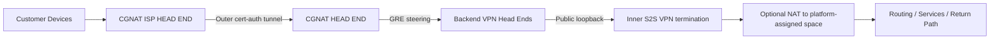

# CGNAT Architecture

## Purpose

This document describes the target architecture for the CGNAT project using the
approved CGNAT nomenclature and guardrails.

The architecture is intentionally expressed as a net-new ingress framework that
hands traffic off to the current backend platform and stays at the design level
until the project reaches the infrastructure test deployment Go / No-Go gate.

## Design Objective

The platform must support a two-layer access model:

1. A CGNAT ISP HEAD END establishes an outer certificate-authenticated tunnel
   to the CGNAT HEAD END.
2. Customer Devices behind the CGNAT ISP HEAD END send an inner S2S VPN
   through that outer tunnel toward the same customer-facing public IP used by
   the current muxer-backed service.
3. The CGNAT HEAD END steers the inner VPN across GRE to a selected backend
   NAT-T or non-NAT VPN head end.
4. The backend VPN head end presents the public loopback identity, terminates
   the inner VPN, and optionally NATs traffic from customer-original inside
   space to platform-assigned inside space.

## Scenario Patterns

The current scope should support two scenario patterns.

### Scenario 1: Collapsed 1:1 Customer Model

In this model:

- one customer device forms the outer tunnel directly
- that same device also originates the inner S2S VPN
- there is a 1:1 relationship between the outer and inner tunnel for that
  customer

Important behavior:

- the outer tunnel is certificate-authenticated
- the outer tunnel is expected to be NAT-T because the customer is behind CGN
- the inner tunnel still targets the existing customer-facing public IP used by
  the current backend service
- the inner tunnel mode is independent from the outer tunnel mode

This means the customer-side "device" and the CGNAT ISP-side function may be
collapsed into one box or one logical endpoint.

### Scenario 2: Aggregated n:1 ISP Model

In this model:

- one ISP-side interconnect gateway forms the outer tunnel
- multiple customer devices sit behind that gateway
- many inner S2S VPNs are carried inside one outer tunnel

Important behavior:

- the outer tunnel is provider/interconnect-owned
- the outer tunnel capability matrix may be broader than Scenario 1
- the inner tunnels still target the same customer-facing public IP used by the
  current backend service
- the CGNAT HEAD END still steers the inner tunnels across GRE to the selected
  backend tier

Scenario 2 is planned as part of the architecture, but Scenario 1 is the
cleaner first implementation target.

The design must also support three architectural layers:

1. a reusable CGNAT framework layer that is not tied to one AWS environment
2. an operations layer that defines where and how the framework is deployed in
   a specific AWS environment
3. a SoT layer that provides intent, inventory, identity, placement, and
   deployment inputs
4. a backend contract layer that defines how the net-new ingress node hands
   traffic to the unchanged backend

## High-Level Architecture

## Component Roles

### Customer Devices

Customer Devices are the downstream systems that ultimately need VPN access
into the platform.

They:

- sit only in `subnet-0e6ae1d598e08d002`
- initiate the inner S2S VPN
- do not use certificates for the inner VPN
- use keys and customer identity material

### CGNAT ISP HEAD END

The CGNAT ISP HEAD END is the customer/carrier-side bridge.

It:

- spans `subnet-04a6b7f3a3855d438` and `subnet-0e6ae1d598e08d002`
- establishes the outer certificate-authenticated tunnel
- provides the transport path used by downstream Customer Devices
- does not terminate the platform-side service intent of the inner VPN

### CGNAT HEAD END

The CGNAT HEAD END is the new platform-side access component we are building.

It:

- exists only in `subnet-04a6b7f3a3855d438`
- terminates the outer certificate-authenticated tunnel
- treats the outer tunnel as the trusted ingress path
- inspects and steers the inner VPN flow
- preserves the existing customer-facing public service IP as the inner VPN
  target
- forwards selected traffic over GRE to backend VPN head ends

### Backend VPN Head Ends

Backend VPN Head Ends remain the existing RPDB NAT-T and non-NAT termination
tiers and are treated as external contract targets.

They:

- receive the inner VPN via GRE from the CGNAT HEAD END
- present the public loopback identity
- terminate the inner VPN
- optionally NAT from customer-original inside space to platform-assigned
  inside space
- provide routing and reverse-path behavior

## Architectural Layers

### Framework Layer

The framework layer is the reusable CGNAT capability we are designing under
`CGNAT/`.

It should define:

- the CGNAT HEAD END behavior
- the CGNAT ISP HEAD END interaction model
- the steering model
- the GRE handoff model
- the translation model
- the control-plane and validation expectations

It must not be hardwired to a single AWS account, VPC, subnet layout, or fixed
instance inventory beyond the declared variable model.

### Operations Layer

The operations layer defines how the framework is instantiated in a real AWS
environment.

It should own concrete deployment data such as:

- AWS account and region context
- VPC and subnet selection
- instance placement
- EIP/public addressing choices
- certificate material references
- backend head-end connectivity choices
- environment-specific rollout and rollback steps

The operations layer is where we answer "where do we actually deploy this" once
the framework is ready.

### SoT Layer

The SoT layer provides the canonical intent and inventory contract for the
framework and operations layers.

It should eventually define or provide:

- CGNAT customer/service intent
- customer identity references
- certificate identity references
- address-assignment intent
- backend head-end inventory and selection inputs
- environment inventory needed by deployment logic

The framework should consume SoT-driven inputs rather than depend on ad hoc or
hardcoded environment values.

For the first implementation, the design should assume CGNAT-owned record
shapes even if the same database platform is reused.

### Backend Contract Layer

The backend contract layer defines what CGNAT must know about the current
backend without changing muxer-owned internals.

It should define:

- GRE handoff expectations
- backend target selection inputs
- public loopback termination expectations
- translation boundary expectations

The backend contract layer is consumed by CGNAT. It is not a permission slip to
modify the existing backend.

## Planes and Responsibilities

### Access Plane

The access plane is the outer tunnel between the CGNAT ISP HEAD END and the
CGNAT HEAD END.

It is responsible for:

- accepting unknown, changing, or CGNATed public source identity
- authenticating with certificates
- creating the trusted transport channel into the platform

### Service Plane

The service plane is the inner S2S VPN initiated by Customer Devices.

It is responsible for:

- carrying customer-specific VPN traffic
- preserving the existing customer-facing public IP/public loopback behavior
- preserving the current RPDB-style backend head-end termination model
- selecting the correct backend VPN head end for service delivery

### Translation Plane

The translation plane is the optional NAT stage that maps:

- customer-original inside space
- to platform-assigned inside space

This must remain symmetric so return traffic follows a clean reverse path.

### Inventory and Intent Plane

The inventory and intent plane is the design layer that ties SoT and operations
to the framework.

It is responsible for:

- describing what should be deployed
- describing where it may be deployed
- describing which customer and backend identities belong together
- exposing enough structured input for the framework to render and validate a
  deployment

## Trust Boundaries

### Boundary 1: Public to Outer Tunnel

The public side of the CGNAT ISP HEAD END is not trusted simply because it can
reach the CGNAT HEAD END.

Trust begins only after successful certificate authentication and outer-tunnel
establishment.

### Boundary 2: Outer Tunnel to Inner VPN

The outer tunnel grants transport into the platform, but it does not replace
customer identity for the inner VPN.

The inner VPN still needs its own steering, keying, and backend selection
logic.

### Boundary 3: Inner VPN to Platform-Assigned Space

If address translation is required, the backend VPN head end must own the
translation boundary so that service-side routing stays deterministic.

## Architectural Constraints

- The CGNAT HEAD END must not depend on fixed public peer IPs.
- The outer tunnel must be certificate-authenticated.
- The inner VPN must not require certificates.
- GRE remains the expected handoff model from the CGNAT HEAD END to backend
  VPN head ends unless later design work proves otherwise.
- The customer-facing inner VPN target must remain the same public IP currently
  used by the existing muxer-backed service.
- Variable-driven placement and addressing are mandatory.
- The framework must be reusable across AWS environments rather than tied to a
  single deployment footprint.
- The operations model must be explicit rather than implied.
- SoT interaction must be treated as a first-class design requirement.
- The backend must be treated as an external contract target, not an extension
  surface.
- No muxer code or schema changes are assumed by this architecture.
- No implementation assumptions in this document override the project guardrail
  that forbids edits outside `CGNAT/` without approval.

## Design Assumptions for the First Project Block

- One CGNAT HEAD END is enough for the initial prototype and lab topology.
- One CGNAT ISP HEAD END is enough to prove the outer-tunnel and inner-VPN
  model.
- Backend NAT-T and non-NAT VPN head ends continue to provide public loopback
  identities.
- The first prototype should prefer minimum moving pieces over premature
  scaling concerns.

## Out of Scope for This Document

- final implementation details of inner VPN classification
- final nftables rule layouts
- final GRE device naming
- production HA behavior
- muxer schema or runtime changes
- backend live apply changes outside `CGNAT/`

Those belong in later design and implementation documents.
