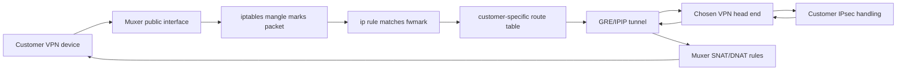

# How The Muxer Works

## Audience

This document is for junior engineers who are new to:

- Linux networking
- routes
- route tables
- routing policy rules
- `iptables`
- GRE or IPIP tunnels
- VPN packet steering

If you have never looked at `ip route`, `ip rule`, or `iptables` before, start
at the beginning and read straight through.

## Purpose

The muxer is the traffic steering box that sits in front of the VPN head ends.

Its job is not just "forward packets." Its real job is:

1. identify which customer a packet belongs to
2. tag that packet with the right customer identity
3. choose the right customer-specific transport path
4. keep reply traffic looking correct to the customer
5. do all of that in a repeatable way from code and customer data

The current RPDB muxer runtime lives in this repo under:

- [`muxer/runtime-package/config/muxer.yaml`](../muxer/runtime-package/config/muxer.yaml)
- [`muxer/runtime-package/src/muxerlib/cli.py`](../muxer/runtime-package/src/muxerlib/cli.py)
- [`muxer/runtime-package/src/muxerlib/core.py`](../muxer/runtime-package/src/muxerlib/core.py)
- [`muxer/runtime-package/src/muxerlib/customers.py`](../muxer/runtime-package/src/muxerlib/customers.py)
- [`muxer/runtime-package/src/muxerlib/variables.py`](../muxer/runtime-package/src/muxerlib/variables.py)
- [`muxer/runtime-package/src/muxerlib/dynamodb_sot.py`](../muxer/runtime-package/src/muxerlib/dynamodb_sot.py)
- [`muxer/runtime-package/src/muxerlib/modes.py`](../muxer/runtime-package/src/muxerlib/modes.py)
- [`muxer/runtime-package/src/muxerlib/dataplane.py`](../muxer/runtime-package/src/muxerlib/dataplane.py)
- [`muxer/runtime-package/src/muxerlib/strongswan.py`](../muxer/runtime-package/src/muxerlib/strongswan.py)
- [`muxer/runtime-package/systemd/muxer.service`](../muxer/runtime-package/systemd/muxer.service)
- [`muxer/runtime-package/systemd/ike-nat-bridge.service`](../muxer/runtime-package/systemd/ike-nat-bridge.service)

## Read This First

The muxer has two different ideas of "doing VPN," and it is very important not
to mix them up.

### Pass-through mode

This is the mode we care about most in the RPDB platform.

In pass-through mode:

- the customer sends encrypted VPN traffic to the muxer
- the muxer does not normally decrypt it
- the muxer classifies it and steers it to the correct VPN head end
- the head end is the system that actually terminates or processes the VPN

### Termination mode

The runtime also has a termination-mode path.

In termination mode:

- the muxer itself can render strongSwan configuration
- the muxer can act like the IPsec endpoint

That code exists, but the current platform model is centered on pass-through
steering to dedicated head ends.

## The Short Version

If you only want the one-paragraph explanation, here it is:

The muxer looks at an inbound packet from a customer, decides which customer it
belongs to based mainly on the source peer IP and allowed protocols, marks the
packet with that customer's fwmark in `iptables`, uses an `ip rule` entry to
map that mark to the customer's private route table, and that route table sends
the packet into a customer-specific GRE or IPIP tunnel toward the correct VPN
head end. On the way back, the muxer uses `iptables` NAT rules so the reply
traffic still appears to come from the correct shared public muxer identity.

That is the whole design in one sentence:

```text
packet -> mark -> policy rule -> customer route table -> customer tunnel -> head end
```

## Big Picture



## What The Muxer Is And Is Not

### The muxer is

- a Linux router
- a packet classifier
- a policy-routing system
- a tunnel endpoint toward the VPN head ends
- a NAT rewrite point for some customer traffic
- a control-plane consumer of customer records

### The muxer is not

- the customer's VPN device
- the canonical business source of customer intent
- the place where all customers should be hand-edited
- just a firewall box
- always the IPsec endpoint

## Control Plane Versus Dataplane

This distinction matters a lot.

### Control plane

The control plane is the "thinking and configuration" side.

Examples:

- customer YAML or JSON
- DynamoDB customer records
- muxer global config
- allocation of marks, tables, tunnel keys, and overlays
- code that renders or applies kernel state

### Dataplane

The dataplane is the "real packets moving through the Linux kernel" side.

Examples:

- Linux interfaces
- routes
- route tables
- `ip rule`
- `iptables`
- tunnels
- packet forwarding

The control plane decides what should exist.

The dataplane is what actually carries packets.

## Linux Networking Basics

Before we talk about muxer code, we need a shared language.

## What Is An Interface

An interface is a network attachment point on the Linux host.

Examples:

- the public-facing ENI
- the inside or transport ENI
- a GRE tunnel interface
- a loopback interface

If you run:

```bash
ip addr
```

you are asking Linux:

```text
What interfaces do I have, and what IP addresses live on them?
```

## What Is A Route

A route tells Linux where to send traffic for a destination.

A route usually answers one of these questions:

- send this destination out interface `X`
- send this destination via next hop `Y`

Examples:

- `10.10.10.0/24 dev gre-cust-0003`
- `default dev gre-cust-0003`

If you run:

```bash
ip route
```

you are asking:

```text
What is the normal forwarding decision for packets on this host?
```

## What Is A Route Table

Linux can have more than one routing table.

That is one of the most important ideas in this system.

Think of a route table like a separate routing notebook.

Instead of having one giant global rule set, Linux can have:

- main table
- local table
- customer table 2003
- customer table 41003
- many more

Each table can hold its own routes.

That lets the muxer say:

```text
Customer A should use tunnel A.
Customer B should use tunnel B.
```

without forcing every packet through the same path.

## What Is The RPDB

RPDB means Routing Policy Database.

The RPDB is what Linux uses for policy routing.

The command:

```bash
ip rule
```

shows the policy rules that decide which route table should be consulted.

Without policy routing, Linux normally just uses the main route table.

With policy routing, Linux can say:

- if the packet has mark `0x2003`, look in table `2003`
- if the packet has mark `0x41003`, look in table `41003`

That is exactly the muxer pattern.

## What Is A Packet Mark Or fwmark

A fwmark is a small numeric tag attached to a packet inside the Linux kernel.

It is not something the customer sees on the wire.

It is internal metadata.

The muxer uses `iptables` to apply the mark.

Then Linux routing policy uses that mark to choose the right route table.

This is the heart of the design:

1. mark the packet
2. use the mark to choose a route table
3. let that route table choose the tunnel

## What Is A Tunnel

A tunnel is a virtual interface that carries packets inside another packet.

The muxer uses customer-specific transport tunnels toward the head ends.

In this codebase the tunnel can be:

- IPIP
- GRE

The tunnel has:

- a local underlay IP
- a remote underlay IP
- a virtual tunnel interface name
- an overlay IP on that interface

The underlay is the real network path.

The overlay is the tunnel-facing point-to-point addressing placed on the tunnel
interface itself.

## Underlay Versus Overlay

This is another concept that confuses people at first.

### Underlay

The underlay is the real network underneath the tunnel.

For the muxer transport path, that means the real IPs used to create the tunnel
between:

- the muxer inside interface
- the chosen head-end underlay IP

### Overlay

The overlay is the virtual point-to-point address space placed on top of the
tunnel.

The code allocates `/30` overlay blocks from an overlay pool.

For example, if the customer id is `3`, the code in
[`muxer/runtime-package/src/muxerlib/customers.py`](../muxer/runtime-package/src/muxerlib/customers.py)
derives:

- network: `169.254.0.8/30`
- muxer overlay IP: `169.254.0.9/30`
- router overlay IP: `169.254.0.10/30`

That overlay does not replace the real underlay. It sits on top of it.

## What Is `iptables`

`iptables` is a Linux packet-processing engine.

The muxer uses it for:

- filtering
- marking packets
- NAT
- optional NFQUEUE handoff to userspace helpers

The important `iptables` tables in this project are:

- `filter`
- `mangle`
- `nat`

## What The `filter` Table Does

The `filter` table decides whether traffic should be allowed or dropped.

Examples in the muxer:

- accept allowed UDP/500 from a specific customer peer
- accept allowed UDP/4500 from a specific peer
- accept allowed ESP protocol 50 from a specific peer
- drop IPsec traffic to the public identity if it does not match an allowed
  customer

## What The `mangle` Table Does

The `mangle` table changes packet metadata.

The most important thing the muxer does here is:

- set the customer-specific fwmark

That is how packets get connected to the RPDB.

## What The `nat` Table Does

The `nat` table rewrites addresses.

The two words you need to know are:

- DNAT: change the destination address
- SNAT: change the source address

The muxer uses NAT mainly so that:

- inbound customer traffic can be normalized to the correct backend delivery
  target
- outbound replies from the head end look like they came from the correct
  public muxer identity

## What Is DNAT

DNAT means destination NAT.

You change where the packet is going.

Example:

```text
Packet arrives for public identity X.
Muxer DNATs it so Linux now forwards it toward backend address Y.
```

## What Is SNAT

SNAT means source NAT.

You change who the packet appears to come from.

Example:

```text
Head-end reply packet comes back with source address 172.31.x.x.
Muxer SNATs it so the customer sees the shared public muxer identity instead.
```

This is critical for reply traffic.

If we do not present the correct source identity, the customer may reject the
reply or route it incorrectly.

## What Is NFQUEUE

NFQUEUE lets `iptables` hand a packet to a userspace program for more complex
processing.

In this repo, the muxer has optional experimental helpers for:

- forced UDP/4500 to UDP/500 bridging
- NAT-D payload rewriting

Those are advanced compatibility features. A junior engineer should first learn
the normal pass-through path before worrying about NFQUEUE.

## The Muxer In Plain English

Here is the muxer in plain English.

Imagine a building lobby:

- the customer is a visitor arriving at the front desk
- the muxer is the security desk
- the mark is the visitor badge color
- the RPDB rule is the rule that says "red badge goes to elevator A"
- the route table is elevator A's destination list
- the tunnel is the elevator shaft to the right head end

The muxer does not do the customer's business meeting.

It just gets the visitor to the correct room and makes sure the return trip is
handled correctly.

## Important Files And What They Mean

## `muxer/runtime-package/config/muxer.yaml`

This is the global muxer runtime config.

It defines things like:

- runtime mode
- public IP
- public and inside interfaces
- customer SoT backend
- backend role map
- overlay pool
- global IPsec defaults
- `iptables` chain names
- NAT rewrite behavior
- base allocation numbers

This file is the top-level "how the muxer behaves" document for the runtime.

## `muxer/runtime-package/src/muxerlib/cli.py`

This is the main CLI entrypoint.

It is the code behind commands like:

- `apply`
- `show`
- `show-customer`
- `apply-customer`
- `remove-customer`
- `render-ipsec`
- `flush`

This file does not contain all the networking logic itself. It loads config,
decides the mode, and then hands off to other modules.

## `muxer/runtime-package/src/muxerlib/core.py`

This is the low-level Linux helper layer.

It wraps commands like:

- `ip addr`
- `ip route`
- `ip rule`
- `ip tunnel`
- `iptables`
- `sysctl`

If you want to know how the runtime actually creates a tunnel or adds an RPDB
rule, this is one of the first files to inspect.

## `muxer/runtime-package/src/muxerlib/customers.py`

This file contains customer-derived helper logic.

It is where the code figures out things like:

- overlay IP allocation
- protocol flags
- tunnel defaults
- NAT-D flags
- head-end egress source list

This is the file that converts customer fields into practical routing inputs.

## `muxer/runtime-package/src/muxerlib/variables.py`

This file answers:

```text
Where do customer records come from, and how are they normalized?
```

It knows how to load customers from:

- DynamoDB
- customer module files
- legacy variable files
- legacy tunnel files

It also resolves backend roles into concrete underlay IPs and egress source IPs.

## `muxer/runtime-package/src/muxerlib/dynamodb_sot.py`

This file handles the customer source-of-truth in DynamoDB.

It knows how to:

- interpret the SoT backend settings
- normalize RPDB-shaped customer items into runtime modules
- build DynamoDB payloads from runtime modules

This is important because the runtime has to support both the newer RPDB model
and older compatibility shapes.

## `muxer/runtime-package/src/muxerlib/modes.py`

This is the real dataplane apply logic.

It contains:

- pass-through full apply
- pass-through customer-scoped apply
- pass-through customer-scoped remove
- termination mode apply

If you want to know:

- what tunnel gets created
- what `iptables` rules are programmed
- what `ip rule` gets added

this is the key file.

## `muxer/runtime-package/src/muxerlib/dataplane.py`

This file does not program the kernel directly.

Instead, it derives a structured explanation of the dataplane.

That makes it useful for:

- validation
- review
- package generation
- documentation

It is a great file for junior engineers because it describes the same behavior
as `modes.py`, but in a more explainable shape.

## `muxer/runtime-package/src/muxerlib/strongswan.py`

This file renders strongSwan configuration for termination mode.

Even though pass-through is the main design, this file is still useful because
it shows how the runtime thinks about:

- local subnets
- remote subnets
- IDs
- PSKs
- global IPsec defaults

## `muxer/runtime-package/systemd/muxer.service`

This systemd service runs the apply process.

One subtle but important detail:

- it is `Type=oneshot`
- it has `RemainAfterExit=yes`

That means the service is not a forever-running packet-forwarding daemon.

Instead:

1. it runs the apply logic
2. the apply logic programs the Linux kernel state
3. the service exits
4. the kernel keeps forwarding based on the programmed state

Junior engineers often expect the muxer to be "a daemon that forwards packets."
In practice, the kernel is doing the forwarding after the apply step.

## `muxer/runtime-package/systemd/ike-nat-bridge.service`

This is a long-running helper service for optional advanced packet rewrite
logic.

It is not the main forwarding engine.

It exists for special compatibility cases involving userspace packet mutation.

## How Customer Data Reaches The Muxer

The muxer cannot steer packets unless it knows what customers exist.

The runtime supports several sources.

## Preferred source: DynamoDB

The long-term RPDB model is:

- one customer item in DynamoDB per customer

That means the muxer can load customer data from the customer SoT table defined
in [`muxer/runtime-package/config/muxer.yaml`](../muxer/runtime-package/config/muxer.yaml).

## Repo file source: customer modules

The runtime can also load normalized customer module files.

This is useful for:

- local testing
- staged package review
- repo-only workflows

## Legacy fallback sources

For compatibility, the runtime can still load:

- legacy variables files
- legacy tunnel files

That is there to ease migration, not because it is the target end state.

## Backend Selection Logic

The loader in
[`muxer/runtime-package/src/muxerlib/variables.py`](../muxer/runtime-package/src/muxerlib/variables.py)
can choose a source backend automatically.

In plain English, the order is roughly:

1. if the config explicitly says use DynamoDB, use DynamoDB
2. otherwise, if customer module files exist, use those
3. otherwise, if legacy tunnel files exist, use those
4. otherwise, if the legacy variables file exists, use that

That lets the runtime support migration periods without changing the main apply
logic.

## How A Customer Record Gets Normalized

No matter where the customer came from, the muxer tries to normalize it into a
common runtime shape with fields like:

- `id`
- `name`
- `peer_ip`
- `protocols`
- `backend_underlay_ip` or `backend_role`
- tunnel fields
- IPsec fields
- optional post-IPsec NAT fields

This is important because the dataplane code wants one consistent model.

It does not want separate apply logic for:

- old variables data
- new RPDB data
- local file data

## How The Muxer Chooses The Head End

The muxer needs a concrete destination for the customer transport tunnel.

That can come from:

- a direct `backend_underlay_ip`
- a `backend_role`

If a `backend_role` is used, the runtime resolves it through the backend role
catalog in [`muxer/runtime-package/config/muxer.yaml`](../muxer/runtime-package/config/muxer.yaml).

That role map can describe:

- active Availability Zone
- underlay IP by AZ
- egress source IPs

This lets a customer say something like:

```text
Use the non-NAT active backend role.
```

without hard-coding the head-end underlay IP into every customer record.

## Why Head-End Egress Source IPs Matter

This is one of the easy-to-miss details.

When the head end replies to the customer, the muxer may need to SNAT those
replies so they appear to come from the correct shared muxer identity.

To do that correctly, the muxer needs to know which source IPs on the head-end
side can actually generate those encrypted replies.

That is why the runtime tracks head-end egress sources.

Without that information:

- return traffic can look like it comes from the wrong address
- the customer may drop it
- packet flow may work one way but fail the other way

## How The Muxer Allocates Customer Transport Values

The muxer config contains base numbers:

- base mark
- base route table
- overlay pool

The runtime then derives customer-specific values from the customer id unless
they are explicitly set.

Examples:

- if base mark is `0x2000` and customer id is `3`, the derived mark becomes
  `0x2003`
- if base table is `2000` and customer id is `3`, the derived route table is
  `2003`

That gives the platform deterministic allocation.

Deterministic means:

```text
Given the same customer id and same rules, we get the same result every time.
```

That makes troubleshooting and migration much easier.

## How Overlay Allocation Works

The overlay pool in the muxer config is a larger network, for example:

```text
169.254.0.0/18
```

The code allocates one `/30` block per customer.

A `/30` gives four addresses:

- network address
- muxer side address
- router side address
- broadcast address

The muxer uses one side and the router or head-end side uses the other.

This is a neat way to give every customer transport tunnel its own little
point-to-point address pair.

## The Core Muxer Commands

On a deployed muxer node, the runtime is typically invoked through commands
like:

- `show`
- `show-customer`
- `apply`
- `apply-customer`
- `remove-customer`
- `render-ipsec`
- `flush`

## `show`

This summarizes all customer modules and the muxer mode.

Use it when you want a high-level answer to:

```text
Who is loaded, what mark/table did they get, what tunnel do they use, and what protocols are enabled?
```

## `show-customer`

This narrows the summary to one customer.

Use it when you want to inspect a single customer without reading the whole
fleet output.

## `apply`

This applies the whole muxer configuration for all loaded customers.

In pass-through mode, that means programming:

- tunnel interfaces
- route tables
- RPDB rules
- `iptables` chains and rules

## `apply-customer`

This applies only one customer's delta.

That is much safer for a customer-scoped deployment model than rebuilding the
entire fleet state every time.

## `remove-customer`

This removes one customer's dataplane state.

That includes:

- customer-specific `iptables` rules
- customer-specific RPDB rule
- customer-specific route table contents
- customer-specific tunnel

## `render-ipsec`

This is for termination mode.

It renders strongSwan config and secrets files.

## `flush`

This removes the muxer's custom `iptables` chains and jumps.

The very important warning is:

```text
flush does not automatically remove ip rules and tunnels
```

That means `flush` is not a full reset.

A junior engineer should be very careful with it and should not assume it
returns the host to a clean baseline.

## What Happens During `apply`

Now we can walk through the real flow.

## Step 1: Load global config

The CLI loads the global muxer config from
[`muxer/runtime-package/config/muxer.yaml`](../muxer/runtime-package/config/muxer.yaml).

That tells it:

- what mode to run
- which interfaces are public and inside
- what public identity to use
- what customer SoT backend to use
- what `iptables` chain names to use
- how to derive transport values

## Step 2: Load customer modules

The runtime then loads customer records from the selected backend.

Those records are normalized so the rest of the dataplane code can treat them
consistently.

## Step 3: Resolve backend identities

If the customer says:

```text
Use backend role X
```

the runtime resolves that to:

- the real head-end underlay IP
- the list of head-end egress source IPs

## Step 4: Ensure Linux sysctls

Before forwarding can work, the runtime enables:

- IPv4 forwarding
- relaxed reverse-path filtering

In simple terms:

- forwarding must be on so Linux behaves like a router
- strict reverse-path filtering would break asymmetric or policy-routed flows

## Step 5: Build or reset the muxer chains

The pass-through apply logic ensures the muxer-specific chains exist in:

- `mangle`
- `filter`
- `nat`

Then it inserts jumps from the standard chains into the muxer-specific chains.

This keeps the muxer's rules grouped together instead of spraying them directly
through the built-in chains.

## Step 6: For each customer, derive transport settings

For each customer, the runtime derives:

- customer id
- mark
- route table
- tunnel mode
- tunnel interface name
- tunnel key if GRE
- local underlay IP
- remote underlay IP
- overlay mux IP
- overlay router IP

That is the transport identity for the customer.

## Step 7: Create or reconcile the customer tunnel

The runtime creates the customer's GRE or IPIP tunnel.

The tunnel is built between:

- the muxer local underlay IP
- the chosen head-end underlay IP

Then it:

- brings the interface up
- assigns the overlay IP on the tunnel

## Step 8: Program the customer route table

The runtime installs a default route in the customer's route table that points
to the tunnel interface.

This means:

```text
Once a packet has been associated with customer table 2003, send it into that customer's tunnel.
```

## Step 9: Program the RPDB rule

The runtime adds an `ip rule` that says:

```text
Packets with mark X should use route table Y.
```

This is the bridge between `iptables` classification and Linux routing.

## Step 10: Program `iptables` classification rules

The runtime then adds rules that:

- match on customer peer IP
- match on allowed protocol and port
- set the customer's fwmark
- allow the traffic in the muxer filter chain

This is how Linux knows:

```text
This inbound packet belongs to Customer 3.
```

## Step 11: Program NAT behavior

If the customer or edge behavior requires it, the runtime also adds NAT rules
for:

- DNAT on the way in
- SNAT on the way out

This is especially important when the public shared identity and internal
private addresses differ.

## Step 12: Kernel starts forwarding

After the apply is done, the Linux kernel has enough state to forward packets.

At that point:

- the service does not need to be a constantly running router daemon
- the kernel dataplane is carrying the traffic

## The Most Important Pass-Through Idea

The single most important pass-through idea is:

```text
The mark is not the route.
The route is not the tunnel.
The mark chooses the route table, and the route table chooses the tunnel.
```

If a junior engineer understands that sentence, they understand the core muxer
design.

## Packet Walkthrough: Strict Non-NAT Customer

Let us walk through a basic strict non-NAT customer.

Assume:

- customer peer IP is `198.51.100.10`
- customer mark is `0x2003`
- customer table is `2003`
- customer tunnel is `gre-cust-0003`
- head-end underlay IP is `172.31.40.220`

### Inbound IKE packet on UDP/500

1. packet arrives on the muxer public interface
2. source matches the customer peer IP
3. destination matches the muxer public identity
4. `iptables` filter rule accepts it
5. `iptables` mangle rule sets mark `0x2003`
6. Linux runs policy routing
7. `ip rule` sees mark `0x2003` and selects table `2003`
8. table `2003` has default route via `gre-cust-0003`
9. packet goes into that customer tunnel
10. packet arrives at the chosen non-NAT head end

### Return packet

1. head end sends a reply back toward the muxer
2. packet leaves the head end with a source IP from a known head-end egress
   source set
3. muxer postrouting SNAT rule matches that source and the customer peer
4. muxer rewrites the source so the customer sees the expected public muxer
   identity
5. customer accepts the reply because it looks like it came from the right
   place

## Why Strict Non-NAT Is Called Strict

In strict non-NAT behavior:

- UDP/500 is expected
- ESP protocol 50 is expected
- UDP/4500 is not the normal path

So the muxer and head-end behavior are centered on preserving that shape.

## Packet Walkthrough: NAT-T Customer

Now let us look at a NAT-T customer.

Assume the customer is really using UDP/4500.

### Inbound packet on UDP/4500

1. packet arrives on the muxer public interface
2. source matches the customer peer IP
3. destination matches the shared public identity
4. `iptables` accepts UDP/4500
5. `iptables` mangle marks the packet for the customer
6. NAT prerouting can DNAT the traffic toward the backend delivery address
7. RPDB chooses the customer route table
8. customer route table points at the transport tunnel
9. packet is sent to the NAT-capable head-end family

### Return packet

1. head end sends encrypted reply traffic back toward the customer
2. muxer matches the head-end egress source IP
3. muxer SNATs the source so the customer sees the expected muxer-side public
   identity
4. customer receives a consistent response path

## Forced 4500 To 500 Bridge Mode

There is also a special compatibility path where a customer behaves like NAT-T
on the wire but the backend handling still needs strict UDP/500 semantics.

That is what the forced `4500 -> 500` bridge logic is for.

This is an advanced path.

The important takeaway for a junior engineer is:

- not all UDP/4500 behavior means "normal NAT-T termination"
- sometimes the muxer is translating the presentation between the customer side
  and the backend side

## Why The Muxer Uses Customer-Specific Route Tables Instead Of One Big Table

This design gives us several benefits.

### Isolation

Each customer gets a separate route decision path.

### Determinism

Given the mark, you know exactly which table and tunnel will be used.

### Simpler debugging

If table `2003` is wrong, it only affects Customer 3's path.

### Better scaling model

Customer-scoped allocation and apply is much easier when each customer has
separate steering primitives.

## Why The Muxer Uses Dedicated Chains

The muxer creates named chains such as:

- `MUXER_MANGLE`
- `MUXER_MANGLE_POST`
- `MUXER_FILTER`
- `MUXER_INPUT`
- `MUXER_NAT_PRE`
- `MUXER_NAT_POST`

This is better than shoving every rule directly into the built-in chains
because:

- the muxer rules are easier to inspect
- the rules are easier to flush or rebuild
- the intent is easier to understand

## What `default_drop_ipsec_to_public_ip` Means

This setting tells the muxer to drop IPsec-looking traffic to the muxer public
identity unless it matches an explicitly allowed customer rule.

That is a safety feature.

It prevents the public IP from behaving like:

```text
accept any UDP/500, UDP/4500, or ESP traffic from anywhere
```

Instead, only known customer peers get accepted.

## What `transport_identity.local_underlay_mode` Means

This setting tells the muxer how to choose its own local underlay identity for
customer tunnels.

### `interface_ip`

Use the actual active inside interface IP on the muxer.

This is safer for staging because it follows the real interface state.

### `module_inside_ip`

Use the inside IP supplied in the customer module.

This preserves older behavior where the customer record carried the muxer-side
underlay identity.

A junior engineer should usually prefer to think in terms of:

```text
The tunnel must have one local underlay IP and one remote underlay IP.
This setting decides where the local one comes from.
```

## What The Muxer Looks Like On The Host

When the runtime is installed on a host, the package is deployed under a muxer
root such as `/etc/muxer`.

That deployed tree contains:

- the runtime config
- customer config inputs
- rendered files
- the Python source used by the service

The repo source is the authoritative place to understand the behavior. The host
filesystem is where that source gets installed.

## A Simple Mental Model For Troubleshooting

When traffic fails, ask these questions in order.

### Question 1: Did the packet hit the muxer?

Check:

- public interface counters
- packet capture
- `iptables` counters

### Question 2: Did the muxer classify it as the right customer?

Check:

- `show-customer`
- peer IP in the loaded customer record
- `iptables` mangle rules for that peer

### Question 3: Did the packet get the right fwmark and route table?

Check:

- `ip rule`
- customer route table contents

### Question 4: Did the tunnel exist and point to the correct head end?

Check:

- `ip tunnel show`
- tunnel local and remote underlay IPs
- tunnel interface address

### Question 5: Did the reply traffic get the right SNAT behavior?

Check:

- `iptables -t nat -S`
- head-end egress source IP list
- packet capture on egress

If traffic works one way but not the other, reply-path NAT is one of the first
things to suspect.

## First Commands A Junior Engineer Should Learn

These are the most useful commands on a muxer.

```bash
ip addr
ip rule
ip route show table all
ip tunnel show
iptables -t mangle -S
iptables -t nat -S
iptables -t filter -S
sudo systemctl status muxer.service --no-pager
sudo systemctl status ike-nat-bridge.service --no-pager
```

And for the muxer runtime summary:

```bash
sudo /etc/muxer/src/muxctl.py show
sudo /etc/muxer/src/muxctl.py show-customer CUSTOMER_NAME
```

## How To Read `ip rule`

If you see a rule like:

```text
10003: from all fwmark 0x2003 lookup 2003
```

read it like this:

```text
If a packet has mark 0x2003, use route table 2003.
```

That is all it means.

## How To Read `ip route show table 2003`

If you see:

```text
default dev gre-cust-0003
```

read it like this:

```text
Any packet that lands in table 2003 should leave through tunnel gre-cust-0003.
```

## How To Read An `iptables` Mark Rule

If you see something like:

```text
-A MUXER_MANGLE -i ens34 -s 198.51.100.10/32 -d 203.0.113.5 -p udp --dport 500 -j MARK --set-mark 0x2003
```

read it like this:

```text
When UDP/500 from that customer peer arrives for the muxer public IP, label the packet as Customer 3.
```

## How To Read An `iptables` SNAT Rule

If you see something like:

```text
-A MUXER_NAT_POST -o ens34 -s 172.31.40.220 -d 198.51.100.10/32 -p udp --sport 500 -j SNAT --to-source 172.31.34.89
```

read it like this:

```text
When a UDP/500 reply from the head end goes back to that customer, present it as coming from the muxer's public-side identity.
```

## Common Failure Patterns

## Failure Pattern 1: Packet arrives but no customer matches

Symptoms:

- traffic reaches the muxer
- no useful mark gets applied
- packet hits default drop behavior

Likely causes:

- wrong customer peer IP
- wrong protocol flags
- customer not loaded from the expected backend

## Failure Pattern 2: Mark exists but route table is wrong

Symptoms:

- packet gets classified
- RPDB rule points to wrong table
- packet leaves through wrong tunnel or no tunnel

Likely causes:

- wrong customer id
- wrong explicit table override
- stale rule from older customer state

## Failure Pattern 3: Tunnel does not exist or points to wrong backend

Symptoms:

- packet is marked
- table exists
- no good transport path to head end

Likely causes:

- backend role resolved to wrong underlay IP
- tunnel failed to create
- underlay source or destination is wrong

## Failure Pattern 4: One-way traffic

Symptoms:

- customer can send traffic in
- reply traffic does not come back correctly

Likely causes:

- missing SNAT for head-end egress source
- wrong public identity
- customer expects a different source address on replies

## Failure Pattern 5: NAT-T behavior not matching expectation

Symptoms:

- customer sends UDP/4500
- strict non-NAT path was assumed
- traffic is inconsistent

Likely causes:

- customer classification should promote to NAT-T path
- wrong protocol settings in the customer record
- advanced bridge behavior was enabled when normal NAT-T was expected

## What Junior Engineers Should Memorize

If you only memorize a few things, memorize these:

1. The muxer is a steering box first, not just a firewall.
2. `iptables` mangle marks packets.
3. `ip rule` maps marks to route tables.
4. Route tables point traffic to customer-specific tunnels.
5. Reply-path SNAT is just as important as inbound steering.
6. Pass-through mode means the head end usually handles the VPN, not the muxer.

## What Senior Engineers Usually Mean When They Say "Check The Muxer"

They usually mean one or more of these:

- Is the customer loaded at all?
- Are the right `nftables` rules present?
- Is the packet being marked?
- Does the RPDB rule exist?
- Does the customer route table point to the correct tunnel?
- Does the tunnel point to the correct head end?
- Does the return traffic get SNATed correctly?

That is the checklist hidden inside the phrase "check the muxer."

## Suggested Reading After This

After this document, the best follow-on references are:

- [`RPDB_TARGET_ARCHITECTURE.md`](./RPDB_TARGET_ARCHITECTURE.md)
- [`CUSTOMER_ONBOARDING_USER_GUIDE.md`](./CUSTOMER_ONBOARDING_USER_GUIDE.md)
- [`MUXER_AND_HEADEND_PLATFORM_DEPLOY_CHECKLIST.md`](./MUXER_AND_HEADEND_PLATFORM_DEPLOY_CHECKLIST.md)
- [`HEADEND_CUSTOMER_ORCHESTRATION.md`](./HEADEND_CUSTOMER_ORCHESTRATION.md)
- [`muxer/runtime-package/config/muxer.yaml`](../muxer/runtime-package/config/muxer.yaml)
- [`muxer/runtime-package/src/muxerlib/variables.py`](../muxer/runtime-package/src/muxerlib/variables.py)
- [`muxer/runtime-package/src/muxerlib/modes.py`](../muxer/runtime-package/src/muxerlib/modes.py)
- [`muxer/runtime-package/src/muxerlib/dataplane.py`](../muxer/runtime-package/src/muxerlib/dataplane.py)

## Final Takeaway

The muxer is best understood as a Linux policy-routing appliance built from
code.

It takes customer intent from a source of truth, turns that intent into:

- packet marks
- RPDB rules
- route tables
- tunnels
- NAT rules

and then lets the Linux kernel carry the packets.

If you understand:

- how a packet gets marked
- how a mark chooses a route table
- how a route table chooses a tunnel
- how reply traffic gets its source identity fixed

then you understand the muxer well enough to start debugging it safely.
