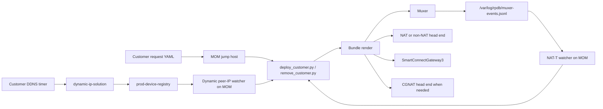

# RPDB Delivery Demo Workbook

## Purpose

This is the technical delivery workbook for the RPDB empty platform. It is
written for a live demo where we need to explain what is happening, show the
right files on disk, and prove that the scripts are changing the platform in a
controlled way.

For live work, run from the MOM/jump-host checkout:

```bash
cd /home/ec2-user/rpdb
```

That matters. The deploy scripts, remove scripts, NAT-T watcher, and dynamic
peer-IP watcher all need to see the same customer request files. If the Windows
repo has a customer file but the MOM checkout does not, the watcher cannot
promote or reapply that customer because it has nothing to correlate against.

Current live demo anchors:

| Item | Value |
| --- | --- |
| Environment | `rpdb-empty-live` |
| MOM checkout | `/home/ec2-user/rpdb` |
| Muxer public IP | `23.20.31.151` |
| SmartConnectGateway3 | `ubuntu@172.31.34.106` |
| NAT head end active | `ec2-user@172.31.40.222` |
| Non-NAT head end active | `ec2-user@172.31.40.223` |
| CGNAT head end | `cgnat-head-end-rpdb-empty-a` |
| CGNAT ISP gateways | `isp-cgnat-router-1`, `isp-cgnat-router-2` |

## How The Platform Hangs Together

The repo is the desired state. The MOM is the live execution point. DynamoDB is
the applied-state record. The muxer is the public edge and packet steering
point. The VPN head ends terminate the customer IPsec sessions. SmartConnect is
the route overlay back toward the offsite/core networks. `dynamic-ip-solution`
stays in place as the detector for changing customer public IPs.



The live apply path is intentionally boring:

```text
request YAML -> validate -> allocate -> render package -> validate bundle
-> resolve live targets -> check backup/owner gates -> copy/apply components
-> validate installed state -> write execution plan and rollback plan
```

The important implementation files are:

| Area | Code path |
| --- | --- |
| Main deploy entrypoint | `scripts/customers/deploy_customer.py` |
| Main remove entrypoint | `scripts/customers/remove_customer.py` |
| SSH live apply orchestration | `scripts/customers/live_apply_lib.py` |
| Customer artifact rendering | `muxer/src/muxerlib/customer_artifacts.py` |
| Muxer install/apply scripts | `scripts/deployment/muxer_customer_lib.py` |
| Head-end install/apply scripts | `scripts/deployment/headend_customer_lib.py` |
| SmartConnect install/apply scripts | `scripts/deployment/smartconnect_customer_lib.py` |
| NAT-T log watcher | `muxer/scripts/watch_nat_t_logs.py` |
| Dynamic peer-IP watcher | `muxer/scripts/watch_dynamic_peer_ip_registry.py` |
| Shared muxer nftables runtime model | `muxer/runtime-package/src/muxerlib/nftables.py` |

## 1. Muxer

### Real Role

The muxer is not just a jump point. It is the customer-facing edge. It owns the
public service IP, pass-through classification, customer fwmarks, customer GRE
handoff interfaces, per-customer route tables, and the muxer-side nftables
state used to keep IPsec traffic looking like it belongs to the public service
address.

For a normal customer, the rendered muxer bundle contains:

| Bundle file | What it controls |
| --- | --- |
| `muxer/customer/customer-summary.json` | Human-readable customer and backend summary. |
| `muxer/routing/rpdb-routing.json` | fwmark, table, priority, and DynamoDB projection. |
| `muxer/routing/ip-rule.command.txt` | `ip rule add pref ... fwmark ... lookup ...`. |
| `muxer/routing/ip-route-default.command.txt` | Default route in the customer table toward the backend. |
| `muxer/tunnel/ip-link.command.txt` | Customer GRE tunnel create/up commands. |
| `muxer/firewall/nftables.apply.nft` | Customer-scoped muxer SNAT nftables table. |
| `muxer/firewall/nftables-state.json` | Table family/name and rule metadata. |

The renderer lives in `muxer/src/muxerlib/customer_artifacts.py`:

| Function | Job |
| --- | --- |
| `build_muxer_artifacts()` | Builds the muxer bundle for one customer. |
| `_render_muxer_firewall_nftables()` | Renders the customer table named with the `rpdb_mx` prefix. |
| `_build_snat_coverage()` | Decides which head-end egress sources need public-edge SNAT. |

### Muxer nftables

The customer-scoped muxer nftables table is an `ip` NAT table. Its main job is
to SNAT head-end egress traffic back to the muxer public/private address before
it leaves the public interface.

The rendered shape is:

```nft
table ip rpdb_mx_<customer> {
  chain postrouting {
    type nat hook postrouting priority srcnat; policy accept;
    oifname "${MUXER_PUBLIC_IFACE}" ip saddr <headend-source> ip daddr <peer>/32 udp sport 500 snat to ${MUXER_PUBLIC_PRIVATE_IP}
    oifname "${MUXER_PUBLIC_IFACE}" ip saddr <headend-source> ip daddr <peer>/32 udp sport 4500 snat to ${MUXER_PUBLIC_PRIVATE_IP}
    oifname "${MUXER_PUBLIC_IFACE}" ip saddr <headend-source> ip daddr <peer>/32 ip protocol esp snat to ${MUXER_PUBLIC_PRIVATE_IP}
  }
}
```

This is why the customer sees a consistent public service endpoint even though
the actual head-end underlay IP is behind the muxer path.

The shared muxer runtime has a second nftables model in
`muxer/runtime-package/src/muxerlib/nftables.py`. That model batches
pass-through behavior across customers. It renders sets and maps instead of
one-off rules:

| Runtime nftables object | Purpose |
| --- | --- |
| `public_destinations` set | Public service addresses accepted by the muxer. |
| `udp500_accept_peers`, `udp4500_accept_peers`, `esp_accept_peers` | Which peers are allowed for each IPsec protocol. |
| `peer_mark_udp500`, `peer_mark_udp4500`, `peer_mark_esp` | Maps source peer IP to customer fwmark. |
| `prerouting_mangle` chain | Applies the customer fwmark before route lookup. |
| `forward_filter` chain | Allows known peers and drops unknown IPsec traffic if default-drop is enabled. |
| `prerouting_nat` chain | DNATs inbound IKE/ESP to the selected backend underlay. |
| `postrouting_nat` chain | SNATs backend replies back to the muxer public/private identity. |
| NFQUEUE bridge sets | Feed force-4500-to-500 and NAT-D rewrite helpers when required. |

The runtime path is what lets the muxer scale. We do not want thousands of
hand-edited firewall rules. The code builds sets/maps, then the apply path
loads a generated nftables batch with `nft -f`.

### Apply Mechanics

`scripts/deployment/muxer_customer_lib.py` installs the rendered customer
bundle under the muxer state roots and writes apply/remove scripts. The firewall
apply script:

```bash
nft list table "${NFT_FAMILY}" "${NFT_TABLE}" >/dev/null 2>&1 && nft delete table "${NFT_FAMILY}" "${NFT_TABLE}"
nft -c -f "${NFT_APPLY}"
nft -f "${NFT_APPLY}"
```

That order is deliberate. It deletes the old customer table, syntax-checks the
new one, and only then loads it.

The master muxer apply script then runs:

```bash
bash "${CUSTOMER_ROOT}/tunnel/apply-tunnel.sh"
bash "${CUSTOMER_ROOT}/routing/apply-routing.sh"
bash "${CUSTOMER_ROOT}/firewall/apply-firewall.sh"
python3 /etc/muxer/src/muxctl.py flush
python3 /etc/muxer/src/muxctl.py apply-customer "${CUSTOMER}"
```

It also clears stale UDP `500` and `4500` conntrack entries for that peer so
old NAT state does not mask the new apply.

### Demo The Muxer

Run on the muxer:

```bash
CUSTOMER="vpn-customer-stage1-15-cust-0004"
ROOT="/var/lib/rpdb-muxer/customers/${CUSTOMER}"
MODULE="/etc/muxer/config/customer-modules/${CUSTOMER}/customer-module.json"

sudo test -f "${MODULE}" && sudo jq . "${MODULE}"
sudo find "${ROOT}" -maxdepth 3 -type f | sort

sudo jq . "${ROOT}/routing/rpdb-routing.json"
sudo cat "${ROOT}/routing/ip-rule.command.txt"
sudo cat "${ROOT}/routing/ip-route-default.command.txt"
sudo cat "${ROOT}/tunnel/ip-link.command.txt"

MX_TABLE="$(sudo jq -r .table_name "${ROOT}/firewall/nftables-state.json")"
sudo nft list table ip "${MX_TABLE}"

sudo ip rule show
sudo ip route show table all | grep -E "gre-cust|169\\.254|fwmark|${CUSTOMER}" || true

sudo systemctl status rpdb-nat-t-listener.service --no-pager
sudo tail -n 40 /var/log/rpdb/muxer-events.jsonl 2>/dev/null || true
```

What to point out during the demo:

| Proof | Why it matters |
| --- | --- |
| `customer-module.json` exists | The muxer has the customer runtime contract. |
| `ip-rule.command.txt` has fwmark lookup | Customer traffic is policy-routed, not globally routed. |
| `nft list table ip "$MX_TABLE"` shows SNAT | The public edge identity is enforced with nftables. |
| `muxer-events.jsonl` has UDP events | NAT-T automation has a real event source. |

## 2. Non-NAT To NAT-T Watcher

### Real Behavior

Dynamic NAT-T customers are first deployed as strict non-NAT. That is not a
bug. It is the detection model. We let the customer try to connect, watch the
muxer, and promote only when traffic proves that NAT-T is required.

The muxer listener writes UDP `500` and UDP `4500` observations to:

```text
/var/log/rpdb/muxer-events.jsonl
```

The MOM watcher then runs the promotion path. It does not blindly react to any
UDP `4500`. `muxer/scripts/watch_nat_t_logs.py` loads the customer request
inventory, validates `dynamic_provisioning`, makes sure peer IPs are unique,
tracks UDP `500`, then accepts UDP `4500` from the same peer inside the
observation window.

The important code path is:

```text
scripts/customers/run_nat_t_watcher.py
-> muxer/scripts/watch_nat_t_logs.py
-> muxer/scripts/process_nat_t_observation.py
-> scripts/customers/deploy_customer.py --observation ... --approve
```

When live SSH access is enabled, the environment default is:

```yaml
promotion:
  mode: remove_reapply
```

That means the watcher removes the old non-NAT customer runtime first, then
applies the NAT package. It is the same customer deployment machinery, not a
separate hand-built migration.

### Demo NAT-T

On the MOM:

```bash
systemctl status rpdb-nat-t-watcher.service --no-pager
journalctl -u rpdb-nat-t-watcher.service -n 100 --no-pager

python3 scripts/customers/run_nat_t_watcher.py \
  --environment rpdb-empty-live \
  --json
```

Use the demo profile when you want a clean scripted presentation:

```bash
python3 scripts/customers/demo_customer_lifecycle.py show customer7-nat-t
python3 scripts/customers/demo_customer_lifecycle.py plan-provision customer7-nat-t --json
python3 scripts/customers/demo_customer_lifecycle.py provision customer7-nat-t --json
python3 scripts/customers/demo_customer_lifecycle.py reapply customer7-nat-t --json
python3 scripts/customers/demo_customer_lifecycle.py remove customer7-nat-t --json
```

If promotion does not happen, check the three things that actually matter:

```bash
grep -R "vpn-customer-stage1-15-cust-0007" muxer/config/customer-requests/migrated
journalctl -u rpdb-nat-t-watcher.service -n 160 --no-pager
tail -n 80 build/nat-t-watcher/out/runner-summary.json 2>/dev/null || true
```

The common misses are stale MOM checkout, missing request file, blocked
customer policy, or UDP `4500` without the required same-peer UDP `500` context.

## 3. Overlap, SmartConnect, And NAT Scope

### The Important Distinction

The platform has to support customers with overlapping private space. The way
we keep that sane is by separating the IPsec selector from the routed scope.

`selectors.remote_subnets` is the IPsec remote traffic selector. It is allowed
to be broad and can overlap between customers.

`selectors.remote_host_cidrs` is the routed customer-side scope inside that
selector. It is what we can safely install on SmartConnect when the customer is
not using inside NAT.

`post_ipsec_nat.translated_subnets` is the inside-NAT presentation. If this is
enabled, SmartConnect must route the translated block, not the raw customer
space.

### SmartConnect Code Rule

The route choice is implemented in
`scripts/deployment/smartconnect_customer_lib.py` and mirrored in
`muxer/src/muxerlib/customer_artifacts.py`:

```text
if post_ipsec_nat.enabled:
    route post_ipsec_nat.translated_subnets
else:
    route selectors.remote_host_cidrs
```

We never install `remote_subnets` on SmartConnect. Those can overlap. Installing
them on the shared route overlay would eventually blackhole customer traffic.

The SmartConnect install code also removes stale candidates from both
`remote_host_cidrs` and `post_ipsec_nat.translated_subnets` before applying the
new route set. That is why a customer can move from raw host routing to
inside-NAT routing without leaving a stale raw route behind.

### Demo SmartConnect

Run on SmartConnectGateway3:

```bash
CUSTOMER="vpn-customer-stage1-15-cust-0011"
ROOT="/var/lib/rpdb-smartconnect/customers/${CUSTOMER}"

sudo jq . "${ROOT}/routing/route-intent.json"
sudo cat "${ROOT}/routing/ip-route.commands.txt"
sudo sed -n '1,140p' "${ROOT}/routing/apply-routes.sh"
ip route show table main | grep -E "172\\.30\\.1\\.|10\\.129\\.|${CUSTOMER}" || true
```

For inside NAT, `route-intent.json` should say:

```json
"customer_route_cidrs_source": "post_ipsec_nat.translated_subnets"
```

For a non-inside-NAT customer, it should say:

```json
"customer_route_cidrs_source": "remote_host_cidrs"
```

That is the clean demo proof that SmartConnect is not routing overlapping
customer encryption domains.

## 4. Head-End NAT And nftables

### Non-NAT Head End Can Still Do NAT

The phrase "non-NAT head end" describes the transport family. It does not mean
customer NAT features are disabled. Inside NAT and outside NAT happen after
IPsec on the head end, and both are rendered as customer-scoped nftables
tables.

The renderer is in `muxer/src/muxerlib/customer_artifacts.py`:

| Function | nftables table prefix | Feature |
| --- | --- | --- |
| `_render_post_ipsec_nat_nftables()` | `rpdb_hn` | Inside NAT, after IPsec. |
| `_render_outside_nat_nftables()` | `rpdb_on` | Outside NAT, customer-visible local/core presentation. |

The installer is `scripts/deployment/headend_customer_lib.py`. It installs the
customer `swanctl` snippet, routes, transport scripts, public identity scripts,
and the two NAT apply/remove directories under:

```text
/var/lib/rpdb-headend/customers/<customer>/
```

### Inside NAT nftables

Inside NAT is `post_ipsec_nat`. It translates customer-side space after the
packet leaves IPsec.

The generated table has:

| nftables object | Meaning |
| --- | --- |
| `core` set | Our side/core networks that can talk to the translated customer view. |
| `translated` set | Customer translated NAT addresses, such as a `/27`. |
| `real` set | Real customer-side addresses behind IPsec. |
| `dnat` map | Translated customer destination back to real customer destination. |
| `snat` map | Real customer source back to translated customer source. |
| `prerouting` chain | Core to translated destination gets DNATed to real customer space. |
| `postrouting` chain | Real customer source gets SNATed to translated space on replies. |
| `mangle_prerouting` chain | Optional mark assignment for the IPsec context. |
| `mangle_forward` chain | Optional TCP MSS clamp derived from `ipsec.path_mtu`. |

The rendered logic looks like this:

```nft
table ip rpdb_hn_<customer> {
  chain prerouting {
    type nat hook prerouting priority dstnat; policy accept;
    ip saddr @core ip daddr @translated dnat to ip daddr map @dnat
  }
  chain postrouting {
    type nat hook postrouting priority srcnat; policy accept;
    ip saddr @real ip daddr @core snat to ip saddr map @snat
  }
}
```

### Outside NAT nftables

Outside NAT presents our local/core network to the customer as a different
customer-visible address. Customer 1 is the easiest demo example:

```text
customer-visible local IP: 10.20.40.10
real backend/core IP:      194.138.36.86
```

The generated outside NAT table has:

| nftables object | Meaning |
| --- | --- |
| `customer_sources` set | Customer sources allowed to use the outside NAT mapping. |
| `translated` set | Customer-visible destination addresses. |
| `real` set | Real local/core addresses. |
| `dnat` map | Customer-visible local destination to real local/core destination. |
| `snat` map | Real local/core source back to customer-visible source. |
| `prerouting` chain | Customer to translated local destination gets DNATed to real local/core. |
| `postrouting` chain | Real local/core reply gets SNATed back to translated local. |

If `outside_nat.customer_sources` is not specified, the code uses
`selectors.remote_host_cidrs`. If that is not present, it falls back to
`selectors.remote_subnets`. For overlap-heavy customers, use
`remote_host_cidrs` or explicit `customer_sources` so the outside NAT scope is
tight.

### Apply Order On The Head End

The generated master apply script runs in this order:

```bash
bash "${CUSTOMER_ROOT}/public-identity/apply-public-identity.sh"
bash "${CUSTOMER_ROOT}/transport/apply-transport.sh"
bash "${CUSTOMER_ROOT}/routing/apply-routes.sh"
bash "${CUSTOMER_ROOT}/outside-nat/apply-outside-nat.sh"
bash "${CUSTOMER_ROOT}/post-ipsec-nat/apply-post-ipsec-nat.sh"
swanctl --terminate --child "${CUST}-child" --force --timeout 10 || true
swanctl --terminate --ike "${CUST}" --force --timeout 10 || true
swanctl --load-all
bash "${CUSTOMER_ROOT}/ipsec/initiate-tunnel.sh"
```

Each NAT apply script deletes the old table if it exists, runs `nft -c -f`, and
then runs `nft -f`.

### Demo NAT On Non-NAT Head End

Run on the non-NAT active head end:

```bash
CUSTOMER="vpn-customer-stage1-15-cust-0001"
ROOT="/var/lib/rpdb-headend/customers/${CUSTOMER}"

sudo find "${ROOT}" -maxdepth 3 -type f | sort
sudo jq . "${ROOT}/post-ipsec-nat/post-ipsec-nat-intent.json"
sudo jq . "${ROOT}/outside-nat/outside-nat-intent.json"

HN_TABLE="$(sudo jq -r .table_name "${ROOT}/post-ipsec-nat/nftables-state.json")"
ON_TABLE="$(sudo jq -r .table_name "${ROOT}/outside-nat/nftables-state.json")"

sudo nft list table ip "${HN_TABLE}" || true
sudo nft list table ip "${ON_TABLE}" || true

sudo swanctl --list-sas | grep -A25 "${CUSTOMER}" || true
sudo conntrack -L 2>/dev/null | grep -Ei "10\\.20\\.30\\.10|10\\.20\\.20\\.10|10\\.20\\.40\\.10|194\\.138\\.36\\.86" || true
```

Customer 1 demo translations:

| Feature | Translation |
| --- | --- |
| Inside NAT | `10.20.30.10 -> 10.20.20.10` |
| Outside NAT | Customer sees `10.20.40.10`; backend/core is `194.138.36.86`. |

## 5. Customer Provisioning Scripts

### Normal Direct Flow

Dry run first:

```bash
python3 scripts/customers/deploy_customer.py \
  --customer-file muxer/config/customer-requests/migrated/vpn-customer-stage1-15-cust-0012.yaml \
  --environment rpdb-empty-live \
  --out-dir build/customer-deploy/cust-0012 \
  --json
```

Approved apply:

```bash
python3 scripts/customers/deploy_customer.py \
  --customer-file muxer/config/customer-requests/migrated/vpn-customer-stage1-15-cust-0012.yaml \
  --environment rpdb-empty-live \
  --out-dir build/customer-deploy/cust-0012 \
  --approve \
  --json
```

Remove:

```bash
python3 scripts/customers/remove_customer.py \
  --customer-name vpn-customer-stage1-15-cust-0012 \
  --environment rpdb-empty-live \
  --out-dir build/customer-remove/cust-0012 \
  --approve \
  --json
```

Use Linux path separators on the jump host. Do not use Windows backslashes or
PowerShell backticks in bash.

### What The Deploy Script Produces

After a dry run, inspect the package before applying:

```bash
CUSTOMER_DIR="build/customer-deploy/cust-0012"

jq . "${CUSTOMER_DIR}/execution-plan.json"
find "${CUSTOMER_DIR}/package/bundle" -maxdepth 3 -type f | sort

sed -n '1,160p' "${CUSTOMER_DIR}/package/bundle/muxer/firewall/nftables.apply.nft"
sed -n '1,180p' "${CUSTOMER_DIR}/package/bundle/headend/post-ipsec-nat/nftables.apply.nft"
sed -n '1,180p' "${CUSTOMER_DIR}/package/bundle/headend/outside-nat/nftables.apply.nft"
jq . "${CUSTOMER_DIR}/package/bundle/smartconnect/routing/route-intent.json"
```

Good demo line:

```text
Before we touch the live node, the repo has already rendered the exact nftables,
route, tunnel, swanctl, SmartConnect, and rollback material we are going to
install.
```

### Demo Wrapper

The wrapper is just a clean entrypoint around the same deploy/remove scripts.
It is useful for delivery demos because the profile names are easy to remember.

```bash
python3 scripts/customers/demo_customer_lifecycle.py list-profiles
python3 scripts/customers/prepare_live_validation_requests.py
python3 scripts/customers/demo_customer_lifecycle.py show customer2-local-psk \
  --environment build/live-validation/rpdb-empty-live-local-psk.yaml
python3 scripts/customers/demo_customer_lifecycle.py verify-clean customer2-local-psk \
  --environment build/live-validation/rpdb-empty-live-local-psk.yaml
python3 scripts/customers/demo_customer_lifecycle.py provision customer2-local-psk \
  --environment build/live-validation/rpdb-empty-live-local-psk.yaml \
  --json
python3 scripts/customers/demo_customer_lifecycle.py verify-deployed customer2-local-psk \
  --environment build/live-validation/rpdb-empty-live-local-psk.yaml
python3 scripts/customers/demo_customer_lifecycle.py reapply customer2-local-psk \
  --environment build/live-validation/rpdb-empty-live-local-psk.yaml \
  --json
python3 scripts/customers/demo_customer_lifecycle.py remove customer2-local-psk \
  --environment build/live-validation/rpdb-empty-live-local-psk.yaml \
  --json
```

For Customer 4 certificate-auth demos, run the customer-side handoff before the
provision step:

```bash
python3 scripts/customers/demo_customer_lifecycle.py install-customer-cert customer4-certificate \
  --environment build/live-validation/rpdb-empty-live-local-psk.yaml \
  --json
python3 scripts/customers/demo_customer_lifecycle.py verify-customer-cert customer4-certificate \
  --environment build/live-validation/rpdb-empty-live-local-psk.yaml
```

That installs the generated certificate, private key, and CA trust on the
Customer 4 Libreswan host, imports the cert/key into the NSS database, writes
the customer-side `/etc/ipsec.d` connection, and reloads IPsec.

Profiles:

| Profile | Demo |
| --- | --- |
| `customer2-local-psk` | Customer 2 local-PSK request, then normal non-NAT-first/NAT-T promotion. |
| `customer4-certificate` | Customer 4 certificate-auth request using generated demo-CA material. |
| `customer5-inside-nat-explicit-map` | Customer 5 inside NAT with explicit host mappings. |
| `cgnat-provided-per-customer-outer` | CGNAT where the customer owns the outer cert tunnel with provided cert material. |
| `cgnat-provided-shared-isp-gateway` | CGNAT where `isp-cgnat-router-2` owns the outer cert tunnel with provided cert material. |

The generated profiles live under `build/live-validation/requests` and are not
committed. That is on purpose: Customer 2 contains a local PSK, and the
certificate demos reference private-key material that should stay on the MOM.

The read-only state verifier is:

```bash
python3 scripts/customers/show_customer_live_state.py \
  --customer-file build/live-validation/requests/vpn-customer-stage1-15-cust-0005-explicit-inside-nat.yaml \
  --environment build/live-validation/rpdb-empty-live-local-psk.yaml \
  --expected deployed
```

It gives the clean/deployed proof per customer: SoT rows, muxer module/fwmark
and nft table, VPN head-end `swanctl` and NAT nft tables, SmartConnectGateway3
route intent/routes, and CGNAT head-end or ISP-gateway handoff state when the
customer is a CGNAT profile.

## 6. Customer Public IP Change

### Real Flow

We are integrating with `dynamic-ip-solution`; we are not replacing it.

Customer devices get a small generated handoff package when
`customer.dynamic_peer_ip.enabled: true`. The customer-side timer runs after
boot and every two minutes. It discovers the current public IP and calls the
dynamic endpoint with the device serial, password, and `myip`.

The dynamic stack updates `prod-device-registry`. The MOM watcher polls that
table, compares `currentIP` to the known peer IP, writes an observation, renders
an updated customer request, and reuses the normal deploy path.

The code path is:

```text
customer generated update-ddns.sh
-> dynamic-ip-solution
-> prod-device-registry
-> scripts/customers/run_dynamic_peer_ip_watcher.py
-> muxer/scripts/watch_dynamic_peer_ip_registry.py
-> muxer/scripts/process_dynamic_peer_ip_change.py
-> scripts/customers/deploy_customer.py
```

### Customer-Side Artifacts

Rendered by `build_customer_device_registry_artifacts()` in
`muxer/src/muxerlib/customer_artifacts.py`:

| Artifact | Purpose |
| --- | --- |
| `dynamic-peer-ip/ddns-config.json` | Serial number, endpoint, password reference, public-IP lookup settings. |
| `dynamic-peer-ip/update-ddns.sh` | Resolves current public IP and calls the DDNS endpoint. |
| `dynamic-peer-ip/install-systemd.sh` | Installs the service and timer. |
| `rpdb-dynamic-peer-ip-update.service` | One-shot update service. |
| `rpdb-dynamic-peer-ip-update.timer` | Runs after boot and every two minutes with jitter. |

Password resolution order:

```text
DDNS_PASSWORD
/etc/rpdb/dynamic-peer-ip/ddns-password.txt
AWS Secrets Manager password_secret_ref
```

Public IP resolution order:

```text
DDNS_MYIP
configured public_ip_command
https://checkip.amazonaws.com
```

### Demo Public IP Change

On the customer VPN node:

```bash
sudo systemctl status rpdb-dynamic-peer-ip-update.timer --no-pager
sudo systemctl status rpdb-dynamic-peer-ip-update.service --no-pager
sudo cat /etc/rpdb/dynamic-peer-ip/ddns-config.json
sudo /usr/local/sbin/rpdb-dynamic-peer-ip-update.sh
```

On the MOM:

```bash
systemctl status rpdb-dynamic-peer-ip-watcher.service --no-pager
journalctl -u rpdb-dynamic-peer-ip-watcher.service -n 120 --no-pager

python3 scripts/customers/run_dynamic_peer_ip_watcher.py \
  --environment rpdb-empty-live \
  --json
```

Registry proof:

```bash
aws dynamodb get-item \
  --region us-east-1 \
  --table-name prod-device-registry \
  --key '{"serialNumber":{"S":"vpn-customer-stage1-15-cust-0012"}}' \
  --consistent-read \
  --output json
```

The clean proof is:

```text
customer timer reports new currentIP -> registry changes -> watcher detects
customer -> normal deploy package re-renders peer.public_ip -> muxer/head-end
runtime is reapplied.
```

## 7. CGNAT

### Real Model

CGNAT is an ingress/transport layer in front of the normal RPDB VPN backend.
It does not create a separate customer product. Once the inner tunnel
terminates, the customer still lands on the same backend capability set:
non-NAT, NAT-T, inside NAT, outside NAT, SmartConnect routing, rollback, and
validation.

The two outer models are:

| Topology | Outer tunnel | Inner tunnel |
| --- | --- | --- |
| `per_customer_outer` | Customer device owns certificate-authenticated outer tunnel to CGNAT head end. | Same customer device owns regular inner VPN. |
| `shared_isp_gateway` | ISP gateway owns certificate-authenticated outer tunnel to CGNAT head end. | Customer device behind ISP owns only the inner VPN. |

The live environment has one CGNAT head end and two ISP gateway targets. The
shared-ISP customer selects a gateway with `outer_gateway_ref`, for example
`isp-cgnat-router-2`.

### Provisioning Boundary

The shared provisioning path currently covers:

| Surface | Status |
| --- | --- |
| Backend VPN customer state | Automated through shared deploy. |
| Muxer customer state | Automated through shared deploy. |
| SmartConnect routes | Automated through shared deploy. |
| CGNAT head-end customer state | Automated through shared deploy. |
| PKI review and handoff material | Generated. |
| Customer-device cutover | Operator-controlled. |
| ISP-gateway cutover | Operator-controlled for `shared_isp_gateway`. |

The live apply orchestrator in `scripts/customers/live_apply_lib.py` treats
CGNAT as another component. If the target selection includes a CGNAT head end,
it copies the prepared CGNAT customer root, runs the CGNAT apply script, and
adds the CGNAT remove step to rollback.

### Demo CGNAT

Per-customer outer:

```bash
python3 scripts/customers/demo_customer_lifecycle.py show cgnat-provided-per-customer-outer \
  --environment build/live-validation/rpdb-empty-live-local-psk.yaml
python3 scripts/customers/demo_customer_lifecycle.py plan-provision cgnat-provided-per-customer-outer \
  --environment build/live-validation/rpdb-empty-live-local-psk.yaml \
  --json
python3 scripts/customers/demo_customer_lifecycle.py provision cgnat-provided-per-customer-outer \
  --environment build/live-validation/rpdb-empty-live-local-psk.yaml \
  --json
python3 scripts/customers/demo_customer_lifecycle.py reapply cgnat-provided-per-customer-outer \
  --environment build/live-validation/rpdb-empty-live-local-psk.yaml \
  --json
python3 scripts/customers/demo_customer_lifecycle.py remove cgnat-provided-per-customer-outer \
  --environment build/live-validation/rpdb-empty-live-local-psk.yaml \
  --json
```

Shared ISP gateway:

```bash
python3 scripts/customers/demo_customer_lifecycle.py show cgnat-provided-shared-isp-gateway \
  --environment build/live-validation/rpdb-empty-live-local-psk.yaml
python3 scripts/customers/demo_customer_lifecycle.py plan-provision cgnat-provided-shared-isp-gateway \
  --environment build/live-validation/rpdb-empty-live-local-psk.yaml \
  --json
python3 scripts/customers/demo_customer_lifecycle.py provision cgnat-provided-shared-isp-gateway \
  --environment build/live-validation/rpdb-empty-live-local-psk.yaml \
  --json
python3 scripts/customers/demo_customer_lifecycle.py reapply cgnat-provided-shared-isp-gateway \
  --environment build/live-validation/rpdb-empty-live-local-psk.yaml \
  --json
python3 scripts/customers/demo_customer_lifecycle.py remove cgnat-provided-shared-isp-gateway \
  --environment build/live-validation/rpdb-empty-live-local-psk.yaml \
  --json
```

Runtime proof on the CGNAT head end:

```bash
sudo swanctl --list-sas || true
sudo swanctl --list-certs || true
sudo ip route show table all | grep -Ei "cgnat|gre|169\\.254|10\\.20|172\\.30|194\\.138" || true
sudo nft list ruleset | grep -Ei "cgnat|dnat|snat|masquerade|10\\.20|172\\.30|194\\.138" || true
```

Certificate proof:

```bash
sudo journalctl --since "-30 min" --no-pager \
  | grep -Ei "IKE_SA|CHILD_SA|certificate|cert|AUTH|authentication|issuer|subject|trusted|CN="
```

The delivery point is not just "CGNAT works." The important point is that both
outer ownership models feed the same inner VPN and backend service model.

## Demo Sequence

A good live demo order:

1. Show a customer request YAML and call out `remote_subnets`, `remote_host_cidrs`, NAT fields, and dynamic fields.
2. Run a dry-run deploy and inspect the generated package before live apply.
3. Show muxer generated routing, GRE, and nftables files.
4. Show head-end generated `swanctl` and nftables files.
5. Apply Customer 2 from the generated local-PSK request and show that NAT-T
   promotion still uses the watcher, not a hand-built NAT deployment.
6. Apply Customer 4 with certificate auth and show `swanctl` loading certs,
   authorities, and public-key authentication instead of PSK.
7. Apply Customer 5 and show SmartConnect routing `translated_subnets`, never
   broad `remote_subnets`.
8. Show Customer 1 style inside NAT and outside NAT on the non-NAT head end.
9. Show customer dynamic-IP timer and the MOM registry watcher.
10. Show CGNAT per-customer outer with provided cert material.
11. Show CGNAT shared ISP gateway with provided cert material.
12. Finish with rollback/remove for one profile to prove lifecycle symmetry.

Opening narrative:

```text
This is not a hand-configured VPN demo. The customer YAML is intent. The MOM
turns that intent into a package with exact route, tunnel, swanctl, nftables,
SmartConnect, CGNAT, and rollback artifacts. Live apply copies those artifacts
to the right nodes, syntax-checks nftables before loading it, reloads strongSwan
where needed, and records the resulting state in DynamoDB.
```

## Useful File And Command Cheatsheet

| Need | Command |
| --- | --- |
| List demo profiles | `python3 scripts/customers/demo_customer_lifecycle.py list-profiles` |
| Show wrapper command | `python3 scripts/customers/demo_customer_lifecycle.py show customer4-non-nat` |
| Dry-run one customer | `python3 scripts/customers/deploy_customer.py --customer-file ... --environment rpdb-empty-live --out-dir ... --json` |
| Approved apply | Add `--approve --json` to `deploy_customer.py`. |
| Approved remove | `python3 scripts/customers/remove_customer.py --customer-name ... --environment rpdb-empty-live --out-dir ... --approve --json` |
| Muxer customer files | `/var/lib/rpdb-muxer/customers/<customer>` |
| Muxer module | `/etc/muxer/config/customer-modules/<customer>/customer-module.json` |
| Head-end customer files | `/var/lib/rpdb-headend/customers/<customer>` |
| SmartConnect customer files | `/var/lib/rpdb-smartconnect/customers/<customer>` |
| Muxer NAT-T events | `/var/log/rpdb/muxer-events.jsonl` |
| NAT-T watcher logs | `journalctl -u rpdb-nat-t-watcher.service -n 120 --no-pager` |
| Dynamic IP watcher logs | `journalctl -u rpdb-dynamic-peer-ip-watcher.service -n 120 --no-pager` |
| nftables live state | `sudo nft list ruleset` |
| IPsec live state | `sudo swanctl --list-sas` |

## Source References

| Area | Repo reference |
| --- | --- |
| MOM architecture | `docs/RPDB_MOM_CONTROL_PLANE_ARCHITECTURE.md` |
| Demo lifecycle wrapper | `docs/RPDB_CUSTOMER_DEMO_LIFECYCLE.md` |
| Customer schema | `muxer/docs/CUSTOMER_SCHEMA.md` |
| NAT-T automation | `muxer/docs/AUTOMATED_NAT_T_DETECTION.md` |
| Dynamic NAT-T model | `muxer/docs/DYNAMIC_NAT_T_PROVISIONING.md` |
| SmartConnect route logic | `scripts/deployment/smartconnect_customer_lib.py` |
| Muxer nftables runtime | `muxer/runtime-package/src/muxerlib/nftables.py` |
| Customer artifact rendering | `muxer/src/muxerlib/customer_artifacts.py` |
| Muxer live installer | `scripts/deployment/muxer_customer_lib.py` |
| Head-end live installer | `scripts/deployment/headend_customer_lib.py` |
| Dynamic peer-IP watcher | `muxer/scripts/watch_dynamic_peer_ip_registry.py` |
| CGNAT overview | `CGNAT/README.md` |
| CGNAT provisioning design | `CGNAT/framework/docs/CUSTOMER_PROVISIONING_INTEGRATION_DESIGN.md` |
