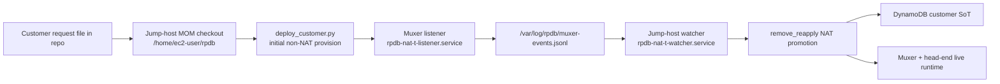
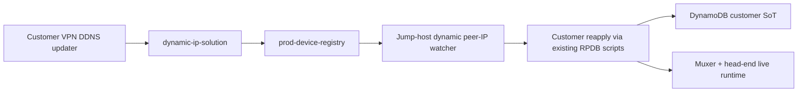

# RPDB MOM Control Plane Architecture

## Purpose

This document captures the current live control-plane architecture for RPDB and
the near-term plan to formalize the jump host as the MOM
(manager-of-managers / master operations manager) for customer lifecycle work.

The goal is not to redesign the platform yet. The goal is to document the
architecture that already exists in practice, fix the repo-split operational
gap we observed on May 10, 2026, and keep `dynamic-ip-solution` integrated as
an external source of truth instead of rewriting it.

## Decision Summary

The jump host at `44.201.38.168` / `172.31.34.79`
(`JUMP-HOST-ANSIBLE-01`, instance `i-01edd5f99fe45e99d`) is the live MOM for
RPDB customer operations.

Effective now, all live customer operations should run from:

```text
/home/ec2-user/rpdb
```

That includes:

- customer provisioning
- customer de-provisioning
- NAT-T promotion / remove-reapply
- dynamic public-IP reapply

The Windows repo and any other checkouts remain valid engineering workspaces,
but they are not the live control-plane authority until their changes are
pulled onto the jump-host MOM checkout.

## As-Is Architecture

### Control-Plane Components

- Repo authoring happens in GitHub / CodeCommit and in local engineering
  workspaces.
- The live execution workspace is the jump-host repo checkout at
  `/home/ec2-user/rpdb`.
- The muxer is the passive event source for NAT-T detection.
- The jump host runs the NAT-T watcher and should also run the dynamic peer-IP
  watcher.
- DynamoDB is the runtime system of record for applied customer state.
- `dynamic-ip-solution` is the authoritative detector for customer public-IP
  changes.

### As-Is NAT-T Flow



### As-Is Dynamic Public-IP Flow



### Current Runtime Fact Pattern

The live system already behaves like a MOM architecture in practice:

- The muxer runs `rpdb-nat-t-listener.service`.
- The jump host runs `rpdb-nat-t-watcher.service`.
- NAT-T promotion is not performed by `deploy_customer.py` itself.
- NAT-T promotion depends on the watcher consuming the muxer event log from the
  jump-host repo checkout.

That means the live execution repo matters just as much as the script code.

## Problem Observed On May 10, 2026

Customer `vpn-customer-stage1-15-cust-0001` was deployed from the Windows
workspace, but the NAT-T watcher was running from `/home/ec2-user/rpdb`.

The muxer listener was working and the customer sent UDP `4500`, but the
watcher ignored the events as `no_matching_dynamic_customer` because the
jump-host repo did not contain the Customer 1 request file.

So the failure was not:

- deploy script logic divergence
- muxer listener failure
- missing UDP `4500` detection

The failure was:

- split control-plane repos
- deploy executed from one repo
- watcher consumed a different repo
- the live MOM checkout did not know about the same customer request set

## Architecture Decision For Now

### Keep `dynamic-ip-solution` Mostly Untouched

We should preserve the current `dynamic-ip-solution` model:

- customer device self-checks in
- stack Lambda processes the update
- `prod-device-registry` is updated

RPDB should integrate to that model, not replace it.

### Formalize The Jump Host As MOM

The jump host becomes the single live actor for:

- `deploy_customer.py`
- `remove_customer.py`
- NAT-T watcher-driven reprovisioning
- dynamic peer-IP watcher-driven reprovisioning

### Keep DynamoDB As State, Not Orchestrator

The SoT tables remain the durable applied-state store, but they should not be
treated as the component that decides what action to take next.

Decision-making and execution remain on the MOM.

## Operating Model

### Source Of Truth Layers

Use this split consistently:

- Git repo: desired customer intent
- Jump-host MOM repo checkout: live execution workspace
- DynamoDB SoT: current applied RPDB customer state
- `dynamic-ip-solution` registry: current customer-reported public IP

### Live Workflow Rules

For live customer work:

1. A user updates or adds a customer request in Git.
2. The jump-host MOM pulls the repo changes.
3. The customer request validates on the jump host.
4. The jump host runs the live deploy or remove script.
5. Watcher services on the jump host handle post-deploy automation.

Do not run live customer lifecycle actions from another checkout unless that
exact change has already been pulled into `/home/ec2-user/rpdb`.

## MOM Services

### Always-On Services

These services should remain continuously active on the jump host MOM:

- `rpdb-nat-t-watcher.service`
- `rpdb-dynamic-peer-ip-watcher.service` once formalized on the jump host

These services should remain continuously active on the muxer:

- `rpdb-nat-t-listener.service`
- `ike-nat-bridge.service`

### Operator-Invoked Scripts

These remain operator-invoked, not always-on:

- `scripts/customers/deploy_customer.py`
- `scripts/customers/remove_customer.py`
- any explicit review / dry-run / execution-plan workflows

## Near-Term Plan

### Phase 1: Make The Jump Host The Only Live Execution Point

- Treat `/home/ec2-user/rpdb` as the authoritative live repo checkout.
- Require customer request files to exist there before any live apply.
- Require validation there before any live apply.
- Stop running live deploy/remove from engineering workspaces that the MOM does
  not consume.

### Phase 2: Align Customer Request Inventory

- Copy or pull the full active customer request set needed for live demos and
  operations into the jump-host repo.
- Confirm the NAT-T watcher watched-customer set includes each live demo
  customer before starting the demo.
- Use the same repo checkout for deploy, remove, and watcher automation.

### Phase 3: Formalize Jump-Host Watcher Services

- Keep `rpdb-nat-t-watcher.service` as the permanent NAT-T automation loop.
- Add or formalize a permanent dynamic peer-IP watcher service on the jump
  host.
- Make the service ownership, logs, and restart behavior part of the runbook.

### Phase 4: Add Preflight Guardrails

Before live deploy:

- verify the customer request exists on the MOM
- verify the request validates on the MOM
- verify the watcher can see the request if NAT-T automation is expected
- verify the environment file is the intended live environment

### Phase 5: Commit And Sync Process

- engineering changes happen in normal local repos
- changes are committed and pushed
- the jump-host MOM pulls them
- only then are live operations run

## Acceptance Criteria

This architecture is working as intended when:

- every live customer deploy and remove is run from `/home/ec2-user/rpdb`
- NAT-T promotions succeed without ad hoc manual repo copying
- customer public-IP changes trigger normal reapply from the jump-host MOM
- the watcher services and live deploy scripts all consume the same repo state
- the SoT reflects the results of MOM-driven actions

## Non-Goals For This Phase

This document does not propose:

- replacing `dynamic-ip-solution`
- moving the full customer lifecycle executor into Lambda
- replacing the jump-host MOM with Step Functions, ECS, or CodeBuild today

Those may be valid future directions, but they are out of scope for the
current stabilization phase.

## Immediate Next Steps

1. Use the jump-host repo as the live MOM for Customer 1 and the remaining
   demo customers.
2. Sync the stage1-15 request files onto the jump host before further live
   customer demos.
3. Formalize the dynamic peer-IP watcher as a jump-host service.
4. Add a preflight checklist item that blocks live apply when the MOM repo does
   not contain the same customer request file the operator expects.
