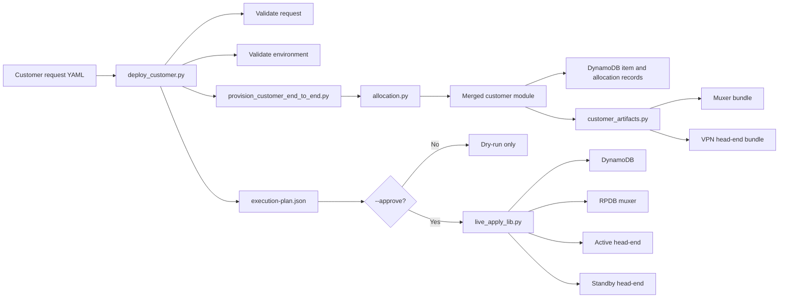

# RPDB Technical Demo Walkthrough

## Purpose

This document turns the RPDB code walkthrough into a demo-ready guide. It is
designed so an engineer can explain the platform from one document without
opening every Python file during the demo.

The core workflow is:

```text
fill out one customer file
run one customer deploy command
validate customer intent and environment
auto-allocate platform resources
render muxer and VPN head-end artifacts
dry-run and review the execution plan
apply only after explicit approval
```

## Architecture



## Customer Intent

Customer request files live under `muxer/config/customer-requests/`. They
describe service intent, not low-level platform allocations.

The customer provides:

- customer name
- peer public IP and peer identity
- local and remote protected subnets
- VPN compatibility settings
- post-IPsec NAT intent when required

The platform assigns:

- customer ID
- fwmark
- route table
- RPDB priority
- tunnel key
- overlay addressing
- muxer and head-end target selection
- allocation records

The operator-facing file should look like this. Notice what is intentionally
missing: no `customer_class`, no `backend.cluster`, and no `protocols`. That is
the point of the new workflow: RPDB starts the customer as strict non-NAT, then
promotes the customer to NAT-T only if the muxer observes UDP/4500 from that
same peer.

This example is stored in
`muxer/config/customer-requests/examples/example-one-command-dynamic-customer.yaml`.

```yaml
schema_version: 1

# Operator-facing request example.
# Do not set customer_class, backend.cluster, or protocols here.
# RPDB starts this as strict non-NAT and promotes to NAT-T only if the muxer
# observes UDP/4500 from this same peer.
customer:
  name: example-one-command-dynamic-customer
  peer:
    public_ip: 203.0.113.60
    remote_id: 203.0.113.60
    psk_secret_ref: /muxingrpdb/customers/example-one-command-dynamic-customer/psk
  selectors:
    local_subnets:
      - 172.31.54.39/32
      - 194.138.36.80/28
    remote_subnets:
      - 10.129.60.12/32
  ipsec:
    ike_version: ikev2
    ike_policies:
      - aes256-sha256-modp2048
    esp_policies:
      - aes256-sha256-modp2048
    dpddelay: 10s
    dpdtimeout: 120s
    dpdaction: restart
    replay_protection: true
    pfs_required: false
    pfs_groups:
      - modp2048
    mobike: false
    fragmentation: true
    clear_df_bit: true
  post_ipsec_nat:
    enabled: false
    mode: disabled
```

Important distinction: `post_ipsec_nat` is not the NAT-T/non-NAT choice. It only
describes whether customer traffic must be translated after IPsec, and what the
real and translated subnets are. RPDB still automatically decides the head-end
family. A customer starts on strict non-NAT, and only a validated UDP/4500
observation from that same peer promotes the customer to the NAT-T head-end.

The next examples are not the preferred operator starting point. They are useful
for explaining what a NAT-capable request and a strict non-NAT request look
like after the intent is more explicit.

Explicit NAT-capable request example:

```yaml
schema_version: 1

customer:
  name: vpn-customer-stage1-15-cust-0004
  peer:
    public_ip: 3.237.201.84
    remote_id: 3.237.201.84
    psk_secret_ref: /muxingrpdb/dev/customers/vpn-customer-stage1-15-cust-0004/psk
  selectors:
    local_subnets:
      - 172.31.54.39/32
      - 194.138.36.80/28
    remote_subnets:
      - 10.129.3.154/32
  ipsec:
    auto: start
    remote_id: 3.237.201.84
    ike_version: ikev2
    ike_policies:
      - aes256-sha256-modp2048
      - aes256-sha256-modp4096
    esp_policies:
      - aes256-sha256-modp2048
      - aes256-sha256-modp4096
    dpddelay: 10s
    dpdtimeout: 120s
    dpdaction: restart
    replay_protection: true
    pfs_required: false
    pfs_groups:
      - modp2048
      - modp4096
    mobike: false
    fragmentation: true
    clear_df_bit: true
  post_ipsec_nat:
    enabled: true
    mode: netmap
    translated_subnets:
      - 172.30.0.64/27
    real_subnets:
      - 10.129.3.154/32
    core_subnets:
      - 172.31.54.39/32
      - 194.138.36.80/28
    tcp_mss_clamp: 1360
```

Explicit strict non-NAT request example:

```yaml
schema_version: 1

customer:
  name: legacy-cust0002
  peer:
    public_ip: 166.213.153.39
    remote_id: 166.213.153.39
    psk_secret_ref: /muxingrpdb/dev/customers/legacy-cust0002/psk
  selectors:
    local_subnets:
      - 172.31.54.39/32
    remote_subnets:
      - 10.129.3.154/32
  ipsec:
    auto: start
    remote_id: 166.213.153.39
    ike_version: ikev2
    dpddelay: 10s
    dpdtimeout: 120s
    dpdaction: restart
    vti_routing: no
    vti_shared: yes
  post_ipsec_nat:
    enabled: false
    mode: disabled
```

Demo point: the operator-facing request names VPN behavior and traffic intent.
It does not manually pick NAT/non-NAT, marks, route tables, tunnel keys,
overlay space, or target nodes.

## Environment Contract

The environment file tells the orchestrator what RPDB-managed nodes and
datastores it may use. The operator does not manually pick targets on the
command line.

Important sections:

```yaml
environment:
  name: rpdb-empty-live
  access:
    method: ssh
  live_apply:
    enabled: true
    requires_approval: true

targets:
  muxer:
    role: muxer
    rpdb_managed: true
    selector:
      type: instance_id
  headends:
    nat:
      active:
        role: nat-headend
        rpdb_managed: true
      standby:
        role: nat-headend
        rpdb_managed: true
    non_nat:
      active:
        role: non-nat-headend
        rpdb_managed: true
      standby:
        role: non-nat-headend
        rpdb_managed: true

datastores:
  mode: dynamodb
  customer_sot_table: muxingplus-customer-sot-rpdb-empty
  allocation_table: muxingplus-customer-sot-rpdb-empty-allocations

customer_requests:
  allowed_roots:
    - muxer/config/customer-requests/migrated
    - muxer/config/customer-requests/examples
  blocked_customers:
    - legacy-cust0003
    - vpn-customer-stage1-15-cust-0003
```

Demo point: the environment contract is the safety boundary. It blocks
disallowed customers, requires RPDB-managed targets, and requires explicit
approval before live apply.

## One-Command Deploy Orchestrator

Primary file:

```text
scripts/customers/deploy_customer.py
```

Example operator-facing dry run:

```powershell
python scripts\customers\deploy_customer.py `
  --customer-file muxer\config\customer-requests\examples\example-one-command-dynamic-customer.yaml `
  --environment rpdb-empty-live `
  --dry-run `
  --json
```

Example Customer 2 dry run:

```powershell
python scripts\customers\deploy_customer.py `
  --customer-file muxer\config\customer-requests\migrated\legacy-cust0002.yaml `
  --environment rpdb-empty-live `
  --dry-run `
  --json
```

Example NAT-T promoted dry run:

```powershell
python scripts\customers\deploy_customer.py `
  --customer-file muxer\config\customer-requests\migrated\vpn-customer-stage1-15-cust-0004.yaml `
  --environment rpdb-empty-live `
  --observation muxer\config\customer-requests\migrated\vpn-customer-stage1-15-cust-0004-nat-t-observation.json `
  --dry-run `
  --json
```

The orchestrator arguments are intentionally simple:

```python
def main() -> int:
    parser = argparse.ArgumentParser(description="Dry-run one-command RPDB customer deploy orchestrator.")
    parser.add_argument("--customer-file", required=True, help="Customer request YAML")
    parser.add_argument("--environment", required=True, help="Deployment environment name or file")
    parser.add_argument("--observation", help="Optional NAT-T observation JSON/YAML")
    parser.add_argument("--out-dir", help="Output directory for execution plan and package")
    parser.add_argument("--dry-run", action="store_true", help="Dry-run only; this is the Phase 2 default")
    parser.add_argument("--approve", action="store_true", help="Execute the approved live apply after all gates pass")
    parser.add_argument("--json", action="store_true", help="Print the execution plan as JSON")
    args = parser.parse_args()
```

Target selection is automatic. The generated package and NAT-T status decide
whether the customer lands on the NAT or non-NAT head-end family:

```python
def _target_selection(*, environment_doc: dict[str, Any], readiness: dict[str, Any]) -> dict[str, Any]:
    customer = readiness.get("customer") or {}
    dynamic_nat_t = readiness.get("dynamic_nat_t") or {}
    backend_cluster = str(customer.get("backend_cluster") or "").strip()
    customer_class = str(customer.get("customer_class") or "").strip()
    use_nat = backend_cluster == "nat" or customer_class == "nat" or bool(dynamic_nat_t.get("used"))
    headend_key = "nat" if use_nat else "non_nat"
    targets = environment_doc.get("targets") or {}
    headends = targets.get("headends") or {}
    selected_pair = headends.get(headend_key) or {}
    return {
        "mode": "dry_run",
        "environment_access_method": ((environment_doc.get("environment") or {}).get("access") or {}).get("method"),
        "muxer": targets.get("muxer"),
        "headend_family": headend_key,
        "headend_active": selected_pair.get("active"),
        "headend_standby": selected_pair.get("standby"),
        "datastores": environment_doc.get("datastores"),
        "artifacts": environment_doc.get("artifacts"),
        "backups": environment_doc.get("backups"),
    }
```

The dry-run plan records what it checked and proves that no live systems were
touched:

```python
"execution_order": [
    "validate_customer_request",
    "validate_deployment_environment",
    "enforce_blocked_customers",
    "provision_repo_only_package",
    "resolve_dry_run_targets",
    "validate_bundle_manifest_and_checksums",
    "validate_backup_references",
    "validate_rollout_owners",
    "write_execution_plan",
],
"live_gate": {
    "status": live_gate_status,
    "approve_supported": allow_live_apply_now,
    "allow_live_apply_now": allow_live_apply_now,
    "reasons": live_apply_reasons,
    "no_live_nodes_touched": True,
    "no_aws_calls": True,
    "no_dynamodb_writes": True,
},
```

Approved apply is only entered when `--approve` is present, the environment
allows live apply, and previous gates passed:

```python
if args.approve and not errors:
    environment_live_apply = (((environment_doc or {}).get("environment") or {}).get("live_apply") or {})
    access_method = str(
        (((environment_doc or {}).get("environment") or {}).get("access") or {}).get("method") or ""
    ).strip()
    if not bool(environment_live_apply.get("enabled")):
        errors.append("environment live_apply.enabled is false")
    else:
        _write_json(execution_plan_path, execution_plan)
        apply_result = execute_live_apply(
            customer_name=customer_name,
            package_dir=package_dir,
            bundle_dir=package_dir / "bundle",
            deploy_dir=deploy_dir,
            target_selection=target_selection or {},
            environment_doc=environment_doc or {},
            execution_plan_path=execution_plan_path,
        )
```

## Package Builder

Primary file:

```text
muxer/scripts/provision_customer_end_to_end.py
```

This script turns one customer request into a complete repo-local review
package.

```python
parser = argparse.ArgumentParser(
    description=(
        "One-file RPDB customer provisioning entrypoint. Given a customer "
        "request YAML, produce the full repo-only provisioning package, "
        "readiness report, bundle, and double-verification artifacts."
    )
)
parser.add_argument("request", help="Customer request YAML")
parser.add_argument(
    "--observation",
    help="Optional NAT-T UDP/4500 observation JSON/YAML. Supplying this promotes the package to NAT-T.",
)
parser.add_argument(
    "--environment-file",
    help=(
        "Environment binding YAML. Defaults to rpdb-empty-nonnat-active-a "
        "for normal requests and rpdb-empty-nat-active-a when --observation is supplied."
    ),
)
```

It delegates the deeper package build to `prepare_customer_pilot.py`:

```python
command = [
    sys.executable,
    "muxer/scripts/prepare_customer_pilot.py",
    str(request_path),
    "--out-dir",
    str(package_dir),
    "--environment-file",
    str(environment_file),
    "--json",
]
if observation_path:
    command.extend(["--observation", str(observation_path)])
```

Demo point: the operator sees one command, while the backend builds the full
review package and readiness report.

## Automatic Allocation

Primary file:

```text
muxer/src/muxerlib/allocation.py
```

The allocator owns these exclusive platform resources:

```python
EXCLUSIVE_RESOURCE_TYPES = (
    "customer_id",
    "fwmark",
    "route_table",
    "rpdb_priority",
    "tunnel_key",
    "overlay_block",
    "transport_interface",
    "vti_interface",
)
```

If a customer request omits explicit stack selection, dynamic NAT-T behavior is
defaulted in:

```python
DEFAULT_DYNAMIC_NAT_T_PROVISIONING = {
    "enabled": True,
    "mode": "nat_t_auto_promote",
    "initial_customer_class": "strict-non-nat",
    "initial_backend_cluster": "non-nat",
    "trigger": {
        "protocol": "udp",
        "destination_port": 4500,
        "require_initial_udp500_observation": True,
        "observation_window_seconds": 300,
        "confirmation_packets": 1,
    },
    "promotion": {
        "customer_class": "nat",
        "backend_cluster": "nat",
        "protocols": {
            "udp500": True,
            "udp4500": True,
            "esp50": False,
            "force_rewrite_4500_to_500": False,
        },
    },
}
```

The allocator walks pool slots and skips anything already consumed:

```python
customer_id = _pool_value(class_pools["customer_id"], slot_index)
fwmark_int = _pool_value(class_pools["fwmark"], slot_index)
route_table = _pool_value(class_pools["route_table"], slot_index)
rpdb_priority = _pool_value(class_pools["rpdb_priority"], slot_index)
tunnel_key = _pool_value(class_pools["tunnel_key"], slot_index)
overlay_block = _overlay_block(class_pools["overlay_block"], slot_index)
overlay = _overlay_endpoints(overlay_block)

if customer_id in inventory["customer_id"]:
    return None
if fwmark_int in inventory["fwmark"]:
    return None
if route_table in inventory["route_table"]:
    return None
if rpdb_priority in inventory["rpdb_priority"]:
    return None
if tunnel_key in inventory["tunnel_key"]:
    return None
if str(overlay_block) in inventory["overlay_block"]:
    return None
```

The selected slot becomes the customer allocation plan:

```python
return {
    "pool_class": normalize_pool_class(
        str(customer_doc.get("customer_class") or ""),
        str(backend_doc.get("cluster") or ""),
    ),
    "slot_index": slot_index,
    "customer_id": customer_id,
    "fwmark": _format_numeric_resource(class_pools["fwmark"], fwmark_int),
    "fwmark_int": fwmark_int,
    "route_table": route_table,
    "rpdb_priority": rpdb_priority,
    "tunnel_key": tunnel_key,
    "overlay_block": str(overlay_block),
    "overlay": overlay,
    "transport_interface": transport_interface,
    "vti_interface": vti_interface,
    "backend_assignment": backend_assignment,
    "backend_role": backend_role,
}
```

Allocation records are written so the platform knows what each customer has
consumed:

```python
records.append(
    {
        "schema_version": 1,
        "resource_type": resource_type,
        "resource_value": resource_value,
        "exclusive": exclusive,
        "pool_name": pool_name,
        "customer_name": customer_name,
        "customer_id": customer_id,
        "customer_class": customer_class,
        "source_ref": source_ref,
    }
)
```

Demo point: onboarding a customer consumes a unique tracked slot. The operator
does not need to choose IDs, marks, tables, priorities, keys, or overlay space.

## Customer Model And Merge

Primary files:

```text
muxer/src/muxerlib/customer_model.py
muxer/src/muxerlib/customer_merge.py
```

The parser normalizes raw YAML into typed customer sections:

```python
def parse_customer_source(raw: Dict[str, Any]) -> CustomerSource:
    customer = raw.get("customer") or {}
    peer = customer.get("peer") or {}
    transport = customer.get("transport") or {}
    overlay = transport.get("overlay") or {}
    selectors = customer.get("selectors") or {}
    backend = customer.get("backend") or {}
    protocols = customer.get("protocols") or {}
    natd_rewrite = customer.get("natd_rewrite") or {}
    dynamic_provisioning = customer.get("dynamic_provisioning")
    ipsec = customer.get("ipsec") or {}
    post_ipsec_nat = customer.get("post_ipsec_nat")
```

The merge layer applies defaults, class behavior, and customer-specific
overrides in that order:

```python
source = parse_customer_source(source_doc)
defaults = copy.deepcopy(defaults_doc.get("defaults") or {})
class_name = str(class_doc.get("class") or "").strip()
class_overrides = copy.deepcopy(class_doc.get("overrides") or {})

if class_name and class_name != source.customer.customer_class:
    raise ValueError(
        f"class mismatch: source={source.customer.customer_class} class_file={class_name}"
    )

merged = _deep_merge(defaults, class_overrides)
merged = _deep_merge(merged, _source_to_module_overrides(source))
```

The DynamoDB item keeps important routing fields top-level and stores the
canonical merged module as `customer_json`:

```python
return {
    "customer_name": customer["name"],
    "customer_id": customer["id"],
    "customer_class": customer["customer_class"],
    "peer_ip": peer["public_ip"],
    "fwmark": transport["mark"],
    "route_table": transport["table"],
    "rpdb_priority": rpdb_priority,
    "backend_underlay_ip": backend.get("underlay_ip") or None,
    "source_ref": source_ref,
    "schema_version": source.schema_version,
    "updated_at": timestamp,
    "customer_json": json.dumps(merged_customer_module, sort_keys=True, separators=(",", ":")),
}
```

Demo point: the model creates one canonical customer module, and DynamoDB stores
the resolved state in an inspectable shape.

## Dynamic NAT-T Promotion

Primary file:

```text
muxer/src/muxerlib/dynamic_provisioning.py
```

Customers start with UDP/500 plus ESP/50:

```python
INITIAL_PROTOCOLS = {
    "udp500": True,
    "udp4500": False,
    "esp50": True,
    "force_rewrite_4500_to_500": False,
}
```

After a valid NAT-T observation, the promoted package enables UDP/4500 and
targets the NAT stack:

```python
PROMOTED_NAT_T_PROTOCOLS = {
    "udp500": True,
    "udp4500": True,
    "esp50": False,
    "force_rewrite_4500_to_500": False,
}
```

The observation must be for UDP/4500:

```python
def normalize_nat_t_observation_event(
    event_doc: Dict[str, Any],
    *,
    default_customer_name: str = "",
) -> Dict[str, Any]:
    """Normalize a muxer-observed UDP/4500 event for repo-only processing."""

    customer_name = str(event_doc.get("customer_name") or default_customer_name).strip()
    if not customer_name:
        raise ValueError("NAT-T observation event must include customer_name")

    peer_value = (
        event_doc.get("observed_peer")
        or event_doc.get("observed_peer_ip")
        or event_doc.get("peer_ip")
    )
    if not peer_value:
        raise ValueError("NAT-T observation event must include observed_peer")
    observed_peer = str(ipaddress.ip_address(str(peer_value).strip()))

    observed_protocol = str(event_doc.get("observed_protocol") or event_doc.get("protocol") or "udp")
    observed_protocol = observed_protocol.strip().lower()
    observed_dport = int(
        event_doc.get("observed_dport")
        or event_doc.get("destination_port")
        or event_doc.get("dport")
        or 4500
    )
```

```python
if normalized["observed_protocol"] != "udp":
    raise ValueError("NAT-T observation event observed_protocol must be udp")
if normalized["observed_dport"] != 4500:
    raise ValueError("NAT-T observation event observed_dport must be 4500")
```

Promotion checks that the customer started as strict non-NAT:

```python
initial_class = str(dynamic.get("initial_customer_class") or "strict-non-nat")
initial_backend = str(dynamic.get("initial_backend_cluster") or "non-nat")
customer_class = str(customer.get("customer_class") or "")
backend_cluster = str((customer.get("backend") or {}).get("cluster") or "")
effective_initial_class = effective_customer_class(customer_class, backend_cluster)
effective_initial_pool = normalize_pool_class(customer_class, backend_cluster)
if initial_class != "strict-non-nat" or effective_initial_class != "strict-non-nat":
    raise ValueError(
        "dynamic NAT-T discovery must start as customer_class=strict-non-nat "
        "or omit the stack so strict non-NAT is selected by default"
    )
if initial_backend != "non-nat":
    raise ValueError("dynamic NAT-T discovery must start with initial_backend_cluster=non-nat")
```

Promotion requires peer match, UDP/4500 trigger match, and initial UDP/500 when
that guardrail is enabled:

```python
observed_peer_ip = str(ipaddress.ip_address(str(observed_peer).strip()))
if observed_peer_ip != peer_ip:
    raise ValueError(f"observed peer {observed_peer_ip} does not match customer peer {peer_ip}")
if str(observed_protocol).strip().lower() != trigger["protocol"]:
    raise ValueError("observed protocol does not match the dynamic NAT-T trigger")
if int(observed_dport) != int(trigger["destination_port"]):
    raise ValueError("observed destination port does not match the dynamic NAT-T trigger")
if trigger["require_initial_udp500_observation"] and not initial_udp500_observed:
    raise ValueError("initial UDP/500 observation is required before NAT-T promotion")
```

The promoted customer is rewritten for the NAT stack, and allocator-owned fields
are removed so NAT pool resources can be assigned cleanly:

```python
promoted_customer = copy.deepcopy(customer)
promoted_customer["customer_class"] = "nat"

backend = dict(promoted_customer.get("backend") or {})
backend["cluster"] = "nat"
promoted_customer["backend"] = backend

promoted_customer["protocols"] = _effective_protocols(
    PROMOTED_NAT_T_PROTOCOLS,
    promotion.get("protocols") or {},
)
promoted_customer["natd_rewrite"] = {"enabled": False}

ipsec = copy.deepcopy(promoted_customer.get("ipsec") or {})
if ipsec:
    ipsec["forceencaps"] = True
    promoted_customer["ipsec"] = ipsec

for allocator_owned in ("id", "transport"):
    promoted_customer.pop(allocator_owned, None)
```

Example observation:

```json
{
  "schema_version": 1,
  "event_id": "vpn-customer-stage1-15-cust-0004-udp4500-pilot",
  "customer_name": "vpn-customer-stage1-15-cust-0004",
  "observed_peer": "3.237.201.84",
  "observed_protocol": "udp",
  "observed_dport": 4500,
  "initial_udp500_observed": true,
  "packet_count": 1,
  "observed_at": "2026-04-15T21:53:33Z",
  "source": "repo-only-pilot"
}
```

Demo point: NAT-T selection is event-driven. The customer starts non-NAT, and
the workflow promotes only after a valid UDP/4500 signal from the same peer.

## Muxer And Head-End Artifact Rendering

Primary file:

```text
muxer/src/muxerlib/customer_artifacts.py
```

Artifact rendering returns separate muxer and head-end trees:

```python
def build_customer_artifact_tree(module: Dict[str, Any], item: Dict[str, Any]) -> Dict[str, Dict[str, Dict[str, Any]]]:
    return {
        "muxer": build_muxer_artifacts(module, item),
        "headend": build_headend_artifacts(module),
    }
```

Muxer artifacts include RPDB rule, route table default route, tunnel creation,
and nftables state:

```python
"routing/ip-rule.command.txt": "\n".join(
    [
        "# Customer-scoped RPDB rule for the muxer",
        f"ip rule add pref {transport.get('rpdb_priority')} fwmark {transport.get('mark')} lookup {transport.get('table')}",
    ]
)
+ "\n",
"routing/ip-route-default.command.txt": "\n".join(
    [
        "# Per-customer table default route on the muxer",
        f"ip route replace table {transport.get('table')} default via ${'{BACKEND_UNDERLAY_IP}'} dev ${'{MUXER_UNDERLAY_IFACE}'} onlink",
    ]
)
+ "\n",
```

```python
"tunnel/ip-link.command.txt": "\n".join(
    [
        "# Customer-scoped muxer tunnel create",
        f"ip link add {transport.get('interface')} type {transport.get('tunnel_type')} "
        f"local ${'{MUXER_TRANSPORT_IP}'} remote ${'{BACKEND_UNDERLAY_IP}'} "
        f"ttl {transport.get('tunnel_ttl')} key {transport.get('tunnel_key')}",
        f"ip addr replace {((transport.get('overlay') or {}).get('mux_ip') or '')} dev {transport.get('interface')}",
        f"ip link set {transport.get('interface')} up",
    ]
)
+ "\n",
```

Muxer firewall/SNAT artifacts are nftables-only:

```python
def _render_muxer_firewall_nftables(customer_name: str, snat_coverage: Dict[str, Any]) -> Dict[str, Any]:
    table_name = _nft_name(customer_name, prefix="rpdb_mx")
    rules = list(snat_coverage.get("rules") or [])
    apply_lines = [
        f"# RPDB customer-scoped muxer firewall/SNAT for {customer_name}",
        "# Backend: nftables only.",
        f"table ip {table_name} {{",
        "  chain postrouting {",
        "    type nat hook postrouting priority srcnat; policy accept;",
    ]
```

```python
"fallback_policy": {
    "backend": "nftables_only",
    "non_nft_fallbacks_allowed": False,
    "external_repo_fallbacks_allowed": False,
},
```

Head-end artifacts include swanctl config, public-identity loopback intent,
customer GRE transport, routes, edge return path, and post-IPsec NAT:

```python
route_commands = [
    "# Customer-scoped head-end routes",
    *[
        f"ip route replace {subnet} dev ${'{HEADEND_CLEAR_IFACE}'}"
        for subnet in (selectors.get("local_subnets") or [])
    ],
]
if peer_public_cidr:
    route_commands.extend(
        [
            "# Return IPsec transport traffic through the customer-scoped GRE path to the muxer edge",
            f"ip route replace {peer_public_cidr} via {mux_overlay_host} dev {transport_interface}",
        ]
    )
```

Post-IPsec NAT is nftables maps and sets:

```python
def _render_post_ipsec_nat_nftables(customer_name: str, post_ipsec_nat: Dict[str, Any]) -> Dict[str, Any]:
    enabled = bool(post_ipsec_nat.get("enabled"))
    safe_customer = _nft_name(customer_name, prefix="cust")
    table_name = _nft_name(customer_name, prefix="rpdb_hn")
    dnat_map = f"{safe_customer}_dnat_v4"
    snat_map = f"{safe_customer}_snat_v4"
    translated_set = f"{safe_customer}_translated_v4"
    real_set = f"{safe_customer}_real_v4"
    core_set = f"{safe_customer}_core_v4"

    host_mappings, warnings = _build_nft_host_mappings(post_ipsec_nat)
    dnat_entries = _nft_map_entries(host_mappings)
    snat_entries = _nft_map_entries([(real_ip, translated_ip) for translated_ip, real_ip in host_mappings])
```

```python
lines = [
    f"# RPDB customer-scoped post-IPsec NAT for {customer_name}",
    "# Backend: nftables only.",
    f"table ip {table_name} {{",
    f"  set {core_set} {{",
    "    type ipv4_addr",
    "    flags interval",
    f"    elements = { _nft_inline_elements(core_values) }",
    "  }",
    f"  map {dnat_map} {{",
    "    type ipv4_addr : ipv4_addr",
    f"    elements = { _nft_inline_elements(dnat_entries) }",
    "  }",
    f"  map {snat_map} {{",
    "    type ipv4_addr : ipv4_addr",
    f"    elements = { _nft_inline_elements(snat_entries) }",
    "  }",
    "  chain prerouting {",
    "    type nat hook prerouting priority dstnat; policy accept;",
    f"    ip saddr @{core_set} ip daddr @{translated_set} dnat to ip daddr map @{dnat_map}",
    "  }",
    "  chain postrouting {",
    "    type nat hook postrouting priority srcnat; policy accept;",
    f"    ip saddr @{real_set} ip daddr @{core_set} snat to ip saddr map @{snat_map}",
    "  }",
]
```

Demo point: the muxer and head-end get customer-scoped artifacts, and NAT is
rendered as nftables state rather than iptables rules.

## Runtime nftables Activation

Primary file:

```text
muxer/runtime-package/src/muxerlib/nftables.py
```

Only nftables backends are accepted:

```python
def _normalize_backend(value: Any, *, default: str = "nftables") -> str:
    raw = str(value or default).strip().lower()
    aliases = {
        "nft": "nftables",
        "nftables": "nftables",
    }
    if raw not in aliases:
        raise ValueError(f"unsupported RPDB firewall backend: {raw}")
    return aliases[raw]
```

Runtime activation writes the generated nftables script and model, replaces the
shared tables, then loads the script:

```python
def apply_passthrough_nft_state(
    modules: Iterable[Dict[str, Any]],
    global_cfg: Dict[str, Any],
) -> Dict[str, Any]:
    model = build_passthrough_nft_model(
        modules,
        global_cfg,
        render_mode="nftables-live-pass-through",
    )
    script = render_passthrough_nft_script(model)
    paths = _artifact_paths(global_cfg)
    _write_text(paths["script_path"], script)
    _write_json(paths["model_path"], model)
    _write_json(paths["bridge_manifest_path"], model.get("bridge") or {})
    sh(["nft", "delete", "table", "inet", model["table"]["name"]], check=False)
    nat_table_name = str(((model.get("translation") or {}).get("nat_table") or {}).get("name") or "")
    if nat_table_name:
        sh(["nft", "delete", "table", "ip", nat_table_name], check=False)
    must(["nft", "-f", str(paths["script_path"])])
```

Demo point: RPDB runtime uses nftables for classification, translation, and
bridge state. The generated state files make the dataplane inspectable.

## Customer Apply On Muxer

Primary file:

```text
scripts/deployment/muxer_customer_lib.py
```

The muxer install function copies customer artifacts, writes the customer
module, writes nftables files, writes route/tunnel scripts, and writes master
apply/remove scripts.

```python
def install_muxer_bundle(bundle_dir: Path, muxer_root: Path) -> dict[str, Any]:
    validation = validate_muxer_bundle(bundle_dir)
    if not validation["valid"]:
        raise ValueError("muxer bundle is not installable: " + "; ".join(validation["errors"]))

    bundle = load_muxer_bundle(bundle_dir)
    layout = build_install_layout(muxer_root, bundle.customer_name)
    layout["customer_root"].mkdir(parents=True, exist_ok=True)
    layout["module_root"].mkdir(parents=True, exist_ok=True)

    if layout["artifacts_root"].exists():
        shutil.rmtree(layout["artifacts_root"])
    layout["artifacts_root"].mkdir(parents=True, exist_ok=True)
```

The master apply sequence is customer-scoped:

```python
return _render_shell_script(
    [
        'ROOT="${RPDB_MUXER_ROOT:-/}"',
        'ROOT="${ROOT%/}"',
        f'CUSTOMER_ROOT="${{ROOT}}{customer_root}"',
        f'MODULE_JSON="${{ROOT}}{module_json}"',
        'test -f "${MODULE_JSON}"',
        'bash "${CUSTOMER_ROOT}/tunnel/apply-tunnel.sh"',
        'bash "${CUSTOMER_ROOT}/routing/apply-routing.sh"',
        'bash "${CUSTOMER_ROOT}/firewall/apply-firewall.sh"',
        'if [ -z "${ROOT}" ] && [ "${RPDB_MUXER_RUNTIME_APPLY:-1}" = "1" ] && [ -f /etc/muxer/src/muxctl.py ]; then',
        '  python3 /etc/muxer/src/muxctl.py flush',
        f"  python3 /etc/muxer/src/muxctl.py apply-customer {quoted_customer}",
        "fi",
    ]
)
```

Demo point: a customer apply installs that customer's module and artifacts, then
asks the RPDB runtime to rebuild nftables state from the runtime inventory.

## Customer Apply On VPN Head-End

Primary file:

```text
scripts/deployment/headend_customer_lib.py
```

The head-end installer writes swanctl config, public identity, GRE transport,
route commands, and post-IPsec NAT nftables artifacts:

```python
_write_text(layout["swanctl_conf"], bundle.text_payloads["ipsec/swanctl-connection.conf"])
_write_json(layout["public_identity_intent"], bundle.json_payloads["public-identity/public-identity-intent.json"])
_write_text(layout["public_identity_apply_script"], bundle.text_payloads["public-identity/apply-public-identity.sh"])
_write_json(layout["transport_intent"], bundle.json_payloads["transport/transport-intent.json"])
_write_text(layout["transport_apply_script"], bundle.text_payloads["transport/apply-transport.sh"])
_write_text(layout["route_commands"], bundle.text_payloads["routing/ip-route.commands.txt"])
_write_text(layout["nft_apply"], bundle.text_payloads["post-ipsec-nat/nftables.apply.nft"])
_write_text(layout["nft_remove"], bundle.text_payloads["post-ipsec-nat/nftables.remove.nft"])
_write_json(layout["nft_state"], bundle.json_payloads["post-ipsec-nat/nftables-state.json"])
_write_json(layout["activation_manifest"], bundle.json_payloads["post-ipsec-nat/activation-manifest.json"])
```

The head-end master apply sequence ensures the shared public identity exists,
creates the customer GRE transport, applies routes, applies post-IPsec NAT, and
reloads strongSwan if it is active:

```python
[
    'bash "${CUSTOMER_ROOT}/public-identity/apply-public-identity.sh"',
    'bash "${CUSTOMER_ROOT}/transport/apply-transport.sh"',
    'bash "${CUSTOMER_ROOT}/routing/apply-routes.sh"',
    'bash "${CUSTOMER_ROOT}/post-ipsec-nat/apply-post-ipsec-nat.sh"',
    'if command -v swanctl >/dev/null 2>&1 && systemctl is-active --quiet strongswan; then',
    '  swanctl --load-all',
    'elif command -v swanctl >/dev/null 2>&1; then',
    '  echo "strongswan is not active; staged config remains at ${SWANCTL_CONF}"',
    'else',
    '  echo "swanctl not found; staged config remains at ${SWANCTL_CONF}"',
    'fi',
]
```

Demo point: the active and standby head-ends can receive the same customer
bundle, while only the active head-end needs strongSwan active at runtime.

## Live Apply And Rollback Shape

Primary file:

```text
scripts/customers/live_apply_lib.py
```

Live apply writes backend records first, validates them, resolves targets,
syncs muxer runtime, applies muxer artifacts, applies active head-end artifacts,
applies standby head-end artifacts, and writes rollback/journal output.

Backend apply and validation:

```python
backend_apply = apply_backend_payloads(
    region=region,
    customer_table=customer_table,
    allocation_table=allocation_table,
    customer_item_plain=customer_item_plain,
    allocation_items_typed=allocation_items_typed,
)
```

```python
backend_validation = validate_backend_payloads(
    region=region,
    customer_table=customer_table,
    allocation_table=allocation_table,
    customer_item_plain=customer_item_plain,
    allocation_items_typed=allocation_items_typed,
)
if not backend_validation.get("valid"):
    raise RuntimeError("backend validation failed after DynamoDB apply")
```

Target instance IDs come from the environment and target selection:

```python
muxer_target = target_selection.get("muxer") or {}
muxer_selector = muxer_target.get("selector") or {}
muxer_instance_id = str(muxer_selector.get("value") or "").strip()
if not muxer_instance_id:
    raise RuntimeError("selected muxer target is missing an instance_id selector")

headend_active = target_selection.get("headend_active") or {}
headend_standby = target_selection.get("headend_standby") or {}
active_instance_id = str(((headend_active.get("selector") or {}).get("value")) or "").strip()
standby_instance_id = str(((headend_standby.get("selector") or {}).get("value")) or "").strip()
if not active_instance_id or not standby_instance_id:
    raise RuntimeError("selected head-end targets are missing instance_id selectors")
```

The muxer runtime is synced before customer apply:

```python
muxer_runtime_remote = _sync_muxer_runtime(
    journal,
    context=context,
    target_name=str(muxer_target.get("name") or "muxer"),
    target_instance_id=muxer_instance_id,
    runtime_prepared=muxer_runtime_prepared,
)
```

Demo point: live apply is gated, journaled, and rollback-aware. It is not a
blind file copy.

## Verification

Primary verification command:

```powershell
python muxer\scripts\run_repo_verification.py
```

Important verification gates include:

- current live approval boundary
- environment validation
- blocked customer policy
- Customer 2 non-NAT dry run
- Customer 4 NAT-T dry run
- nftables-only head-end bootstrap contract
- nftables runtime render and apply gates
- customer-scoped muxer apply/remove behavior
- customer-scoped head-end apply/remove behavior
- head-end post-IPsec NAT nftables activation
- synthetic scale harness
- local workspace/chat reference scrub

Example verification for nftables bootstrap:

```python
if any("nftables" not in line for line in headend_install_lines):
    raise SystemExit("VPN head-end template must install nftables on both nodes")
if any("iptables" in line for line in headend_install_lines):
    raise SystemExit("VPN head-end base package install must not include iptables packages")
```

Example verification for runtime nftables replacement:

```python
if 'sh(["nft", "delete", "table", "inet"' not in runtime_nftables_text:
    raise SystemExit("runtime nftables apply must replace the shared classifier table before loading")
if 'sh(["nft", "delete", "table", "ip"' not in runtime_nftables_text:
    raise SystemExit("runtime nftables apply must replace the shared NAT table before loading")
```

## Demo Talk Track

The operator-facing workflow is intentionally small: fill out one customer file
and run one customer deploy command. The customer file defines service intent,
while RPDB assigns every reusable platform resource automatically.

Every normal customer starts on the strict non-NAT path. If the muxer observes a
valid UDP/4500 signal from the same peer, RPDB builds a promoted NAT-T package
and selects the NAT head-end family automatically.

The muxer receives a customer-scoped RPDB rule, per-customer route table, GRE
tunnel, and nftables artifact. The VPN head-end receives swanctl config, the
shared public identity loopback, the matching customer GRE transport, routes,
edge return path, and post-IPsec NAT nftables maps. The runtime path is
nftables-based, not iptables-based.

Before live deployment, the execution plan shows what would be touched:
DynamoDB tables, muxer, active head-end, standby head-end, artifact location,
backup references, and rollback owners. Live apply only runs after explicit
approval and successful gates.

## Key Takeaways

- The customer file is the operator interface.
- Allocation is automatic and tracked.
- NAT-T selection is event-driven.
- Muxer and head-end artifacts are customer-scoped.
- Runtime classification and NAT use nftables.
- Dry-run is the normal review path.
- Live apply requires approval and produces rollback/journal output.
