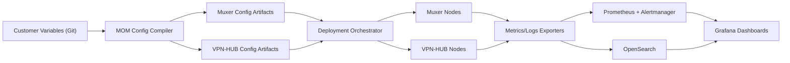

# MOM Project Plan

## 1. Objective

Build a **MOM (Muxer Operations Manager)** platform that can:

1. Deploy Muxer and VPN-HUB configurations safely.
2. Manage lifecycle, drift, and rollback for all customer tunnels.
3. Monitor health, performance, and failures across Muxer and VPN-HUB nodes.

## 2. Scope

In scope:

1. Control-plane design for Muxer and VPN-HUB.
2. Configuration compilation from source-of-truth customer variables.
3. Deployment orchestration and rollback.
4. Monitoring, alerting, and operational dashboards.
5. Runbooks and automated diagnostics.

Out of scope for phase 1:

1. Billing/chargeback.
2. Full customer self-service portal.
3. Multi-cloud abstraction beyond AWS baseline.

## 3. Design Principles

1. **Single source of truth** for customer definitions.
2. **Idempotent deploys** and deterministic config rendering.
3. **Fast rollback** for every change.
4. **Observable by default** (metrics, logs, traces/events).
5. **Separation of concerns**:
   - inventory and intent
   - deployment orchestration
   - telemetry and alerting

## 4. Target MOM Architecture (V1)

## 5. Workstreams

1. **WS1: Source of Truth and Data Model**
   - Extend `customers.variables.yaml` schema.
   - Add validation and lint checks.
   - Add change approval gates.

2. **WS2: Deployment and Change Management**
   - Build release pipeline for Muxer and VPN-HUB bundles.
   - Add pre-check, apply, verify, rollback stages.
   - Add canary rollout policy.

3. **WS3: Monitoring and Alerting**
   - Standardize node exporters and service exporters.
   - Define SLO-aligned alerts.
   - Build role-based dashboards (NOC, engineering, escalation).

4. **WS4: Operations and Reliability**
   - Create runbooks for tunnel-down, packet loss, rekey loops, NAT mismatch.
   - Add periodic health probes and synthetic tests.
   - Add backup and restore workflows.

5. **WS5: Security and Access**
   - RBAC across MOM UI/API and automation.
   - Secret handling and key rotation process.
   - Audit trails for every config mutation and deployment.

## 6. Delivery Phases

### Phase 0 (Week 1): Foundation

1. Finalize requirements and acceptance criteria.
2. Freeze baseline architecture and toolchain.
3. Define success metrics and error budgets.

### Phase 1 (Weeks 2-4): MVP Control Plane

1. Deploy source-of-truth model and renderer pipeline.
2. Implement deploy + rollback for one Muxer and one VPN-HUB group.
3. Deliver first monitoring dashboard and alert policy.

### Phase 2 (Weeks 5-7): Production Hardening

1. Add drift detection and reconciler jobs.
2. Add full preflight checks and staged rollout.
3. Add HA for monitoring components.

### Phase 3 (Weeks 8-10): Scale and Automation

1. Validate at staged customer counts (15 -> 100 -> 500).
2. Add automated performance and resilience tests.
3. Build advanced diagnostics and reporting.

### Phase 4 (Weeks 11-12): Operational Readiness

1. Run cutover rehearsals.
2. Complete runbooks and on-call handoff.
3. Final go/no-go and production launch.

## 7. Acceptance Criteria

1. Config changes deploy with no manual host edits.
2. Every deployment has automatic rollback metadata.
3. Tunnel health and packet-path KPIs visible in one dashboard set.
4. Alerting noise reduced via grouping/inhibition/silencing policy.
5. Demo scenario: deploy, fail, detect, rollback, recover end-to-end.

## 8. KPIs and SLO Signals

1. Deployment success rate.
2. Mean time to detect (MTTD).
3. Mean time to restore (MTTR).
4. Tunnel establishment success rate.
5. Rekey failure rate.
6. Packet loss and throughput per tenant path.

## 9. Risks and Mitigations

1. **Mixed NAT-T and non-NAT peers increase policy complexity**
   - Mitigation: explicit protocol policy and per-customer validation.

2. **Release cadence risk for some upstream projects**
   - Mitigation: prefer actively maintained upstreams or isolate dependency behind MOM adapters.

3. **License obligations for forks**
   - Mitigation: legal review before distributing modified binaries/services.

4. **Telemetry cardinality growth at scale**
   - Mitigation: label hygiene and retention tiers.

## 10. Immediate Next Steps

1. Approve MOM V1 stack from `MOM_PLATFORM_SHORTLIST.md`.
2. Create epics and sprint backlog for WS1-WS3.
3. Stand up non-prod MOM control plane and begin Phase 1 execution.
