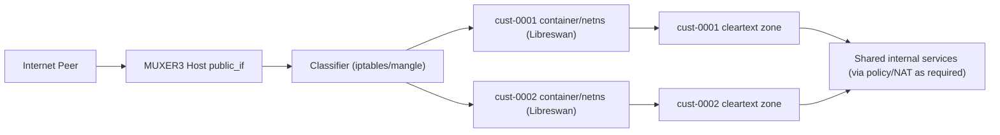

# MUXER3 Architecture

Version: draft v1  
Date: 2026-03-06  
Status: design target (repo-only)

## 1. Purpose

MUXER3 replaces the previous muxer + 8000V chain with a muxer-only IPsec edge.

Primary goals:

- remove 8000V from the IPsec data path
- isolate each customer in its own termination boundary
- support overlapping customer protected IPs
- support mixed customer policy:
  - strict peers (`udp/500` + `esp/50` only)
  - NAT-capable peers (`udp/500`, `udp/4500`, `esp/50`)

## 2. Non-goals

- Target architecture avoids packet-content rewrites where possible. The current AWS strict non-NAT implementation still uses NAT-D rewrite on the muxer for legacy strict peers.
- Do not solve strict-peer edge issues by silently relaxing the backend to NAT-T. If strict `udp/500 + esp/50` must be preserved, document the explicit edge correction in use.
- No dependency on IOS-XE crypto-map-on-tunnel behavior.

## 3. Hard constraints

- NAT in path requires NAT-T behavior in IKEv2 flows.
- Strict customer mode is valid only when NAT is not present.
- AWS EIP association is still a NAT-like edge for strict peer behavior; do not treat it as native public L3.
- On the current AWS edge, strict peers may still need NAT-D rewrite on the muxer to preserve `udp/500 + esp/50` behavior end to end.
- Customer overlap requires strict routing/policy isolation at termination.

## 3.1 Current proven AWS strict non-NAT implementation

The current implementation that is proven live is narrower than the long-term architecture target:

- muxer keeps strict non-NAT backend delivery on the shared public identity
- muxer enables `natd_rewrite.enabled=true`
- muxer keeps `force_rewrite_4500_to_500=false`
- non-NAT head end currently uses strongSwan with `encapsulation=no`
- current validated `legacy-cust0002` selectors are:
  - local `172.31.54.39/32`
  - remote `10.129.3.154/32`
- the `/27` overlap model is not currently in service for `legacy-cust0002`
- demo/core return traffic must route the remote protected `/32` back to the non-NAT core ENI, or the tunnel will appear inbound-only even when decap is healthy

This is the main operational lesson:

- strict non-NAT on AWS currently depends on preserving the public identity at the muxer while fixing NAT detection before the head end sees the flow
- do not assume a healthy strict tunnel can be debugged from head-end IKE state alone; the return route from the cleartext side matters just as much

## 4. High-level design

Each customer gets an isolated Libreswan runtime (container or netns).  
The host muxer classifies ingress packets and sends them to the correct customer runtime.

## 5. Core components

## 5.1 Host muxer

- Public ingress interface (`public_if`).
- Customer classification chains (`MUXER_*`) managed by `muxctl.py`.
- Policy routing (`fwmark` -> per-customer table).
- Optional per-customer handoff tunnel (`gre`/`ipip`) if needed for internal transport.

## 5.2 Customer termination runtime

One unit per customer:

- Libreswan/Pluto daemon and per-customer config
- dedicated network namespace (via container or native netns)
- dedicated veth pair between host and customer namespace
- dedicated xfrm state and routing table inside namespace

Required container capabilities:

- `NET_ADMIN`
- `NET_RAW`
- access to kernel xfrm stack

## 5.3 Configuration model

Global: `config/muxer.yaml`  
Per customer: `config/tunnels.d/cust-*.yaml`

Per-customer policy fields (existing model):

- `protocols.udp500`
- `protocols.udp4500`
- `protocols.esp50`

Per-customer identity/selectors:

- peer public IP
- local/remote protected subnets
- IKE identity and PSK/cert material

## 6. Network and isolation model

## 6.1 Ingress classification

Ingress packet tuple is matched by:

- source peer IP (`peer_ip`)
- destination (muxer public IP/private destination)
- protocol and port (`udp/500`, `udp/4500`, `esp/50`)

Packets are marked and sent to per-customer route table.

## 6.2 Host <-> customer runtime interconnect

Per customer:

- host veth: `veth-cust-XXXX-h`
- runtime veth: `veth-cust-XXXX-c`
- transfer subnet: unique /30 per customer (or /31 if preferred)

This interconnect carries outer IKE/ESP to customer runtime and carries cleartext return path back to host policy domain.

## 6.3 Overlapping address support

Overlapping protected subnets are safe because:

- each customer xfrm/route namespace is independent
- same remote subnet can exist in multiple customer runtimes
- no shared global route dependency for protected subnet decisions

## 6.4 Internal service reachability

Two patterns:

- isolated tenant services: route directly into tenant-specific backend segment
- shared internal services: optional post-decrypt SNAT per customer before entering shared domain

## 7. Customer classes

## 7.1 Strict class (non-NAT peer)

Allowed:

- `udp/500`
- `esp/50`

Denied:

- `udp/4500`

Libreswan connection intent:

- `encapsulation=no`

Current AWS note:

- for the currently proven legacy path, strongSwan + VTI is the active strict non-NAT implementation on the head end
- do not assume the current live strict customer path is using Libreswan route-based/XFRM

## 7.2 NAT-capable class

Allowed:

- `udp/500`
- `udp/4500`
- `esp/50`

Libreswan connection intent:

- `encapsulation=auto` (or `yes` where required by peer behavior)

## 8. Security controls

- default drop for unmatched IKE/ESP to public identity
- per-customer allow-lists by peer public IP
- per-customer credentials stored separately
- least privilege on runtime filesystem mounts
- secrets outside git (runtime injection only)

## 9. Observability and troubleshooting

## 9.1 Host-level

- ring-buffer tcpdump on public ingress and customer veth interfaces
- `iptables -v -S` packet counters by customer chain/rule
- `ip rule show`, `ip route show table <id>`

## 9.2 Runtime-level (per customer)

- `ipsec status` / `ipsec whack --trafficstatus`
- xfrm state/policy counters
- namespace-local packet capture

## 9.3 Required telemetry outcomes

For successful tunnel:

- IKE SA established
- CHILD SA installed
- encaps/decaps increment both directions
- DPD stable over configured interval

## 10. Failure handling

Common failure classes:

- proposal mismatch (DH/PRF/encryption/integrity)
- identity mismatch (`leftid`/`rightid`)
- selector mismatch (`leftsubnet`/`rightsubnet`)
- NAT behavior mismatch vs customer policy class
- steering mismatch (wrong mark/table/namespace)

Recovery actions:

- clear only affected customer SA/runtime
- preserve other customer runtimes
- run per-customer health check before re-enabling traffic

## 11. Rollout plan

## Phase 1: Repo and tooling

- finalize customer runtime spec in `muxctl.py`
- add runtime templating and lifecycle commands:
  - `muxctl runtime-apply`
  - `muxctl runtime-show`
  - `muxctl runtime-teardown`

## Phase 2: Single customer canary

- onboard one NAT-capable customer
- validate control/data plane and failover behavior

## Phase 3: Strict customer onboarding

- onboard one strict (`500/esp only`) non-NAT customer
- validate no `4500` dependency in real path

## Phase 4: Multi-customer overlap validation

- onboard two customers with overlapping protected subnets
- verify isolation and policy correctness

## 12. Acceptance criteria

- 8000V removed from IPsec path
- per-customer independent SA lifecycle
- overlapping customer IPs coexist without route collision
- mixed strict/NAT-capable policies enforced per customer
- no cross-customer traffic bleed

## 13. Open design decisions

- container runtime choice: Docker vs Podman vs native netns
- secret delivery method: file mount vs external secret store
- internal shared-service model: routed vs SNATed per customer
- HA model: active/standby muxer with state sync boundaries

## 14. Implementation references in this repo

- Global config: `config/muxer.yaml`
- Customer modules: `config/tunnels.d/`
- Controller: `src/muxctl.py`
- Prior test history: `docs/TEST_CASES_AND_DEPENDENCIES.md`
- Initial transition notes: `docs/MUXER3_CONTAINER_PLAN.md`

## 15. AWS dependencies for target architecture

- Disable source/destination check on muxer EC2 instance (forwarding role).
- Ensure SG/NACL coverage for customer class:
  - strict: `udp/500`, `esp/50`
  - NAT-capable: `udp/500`, `udp/4500`, `esp/50`
- Do not deploy strict non-NAT customers behind a plain EC2/EIP association and assume they will stay on `udp/500 + esp/50`.
- For strict non-NAT customers on AWS, use an ingress model that preserves the public destination identity end-to-end, such as Internet Gateway ingress routing with BYOIP.
- Do not place strict ESP paths behind NAT Gateway (ESP unsupported there).
- Keep deterministic egress symmetry when multiple ENIs are attached (policy routing required).
- Account for EIP-to-private mapping in all classifier and logging logic.
- If the strict peer must remain on `udp/500 + esp/50`, document whether the muxer is using NAT-D rewrite or some other public-identity-preserving edge correction.
- For direct `/32 <-> /32` demo validation, document the cleartext-side return route explicitly. Missing return routing can look like an IPsec failure even when decap is working.
- Validate MTU/MSS across encapsulation stack before production onboarding.

## 16. Cisco peer interoperability dependencies

- Customer Cisco peers must match IKE proposals exactly (DH group, PRF, encryption, integrity), or negotiation fails with `NO_PROPOSAL_CHOSEN`.
- Traffic selectors (crypto ACL on Cisco peers vs `leftsubnet/rightsubnet` in Libreswan) must be symmetric.
- If peer path includes NAT, Cisco side must allow NAT-T behavior (`udp/4500`) even when preferred mode is `udp/500 + esp/50`.
- For designs that keep Cisco in-path in future variants, IOS-XE policy crypto map interface constraints and VRF-aware IPsec rules still apply.

Reference links (Cisco):

- VRF-aware IPsec (IOS XE 17.x):  
  <https://www.cisco.com/c/en/us/td/docs/routers/ios/config/17-x/sec-vpn/b-security-vpn/m_sec-vrf-aware-ipsec-0.html>
- GRE over IPsec (route-based/tunnel protection guidance):  
  <https://www.cisco.com/c/en/us/td/docs/switches/lan/catalyst9300/software/release/17-16/configuration_guide/sec/b_1716_sec_9300_cg/configuring_gre_over_ipsec.html>
- IKEv2 troubleshooting and debug interpretation:  
  <https://www.cisco.com/c/en/us/support/docs/ip/internet-key-exchange-ike/115934-technote-ikev2-00.html>
